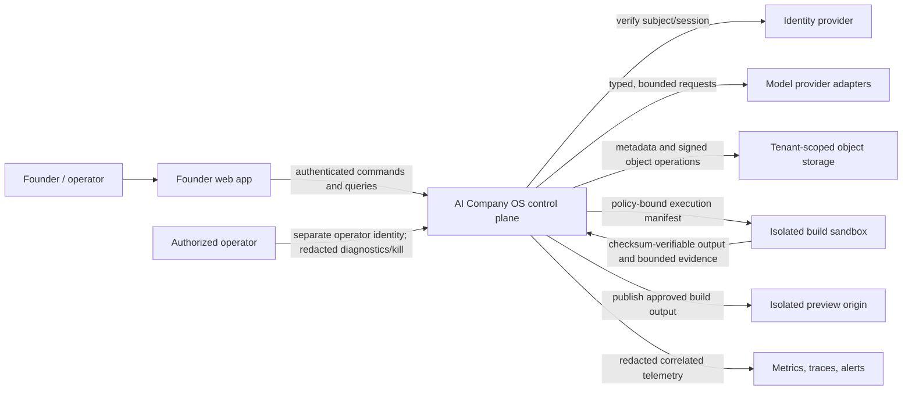
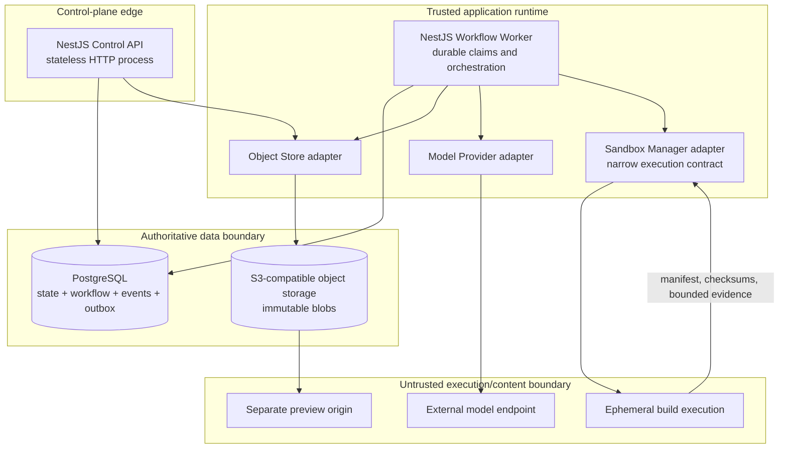
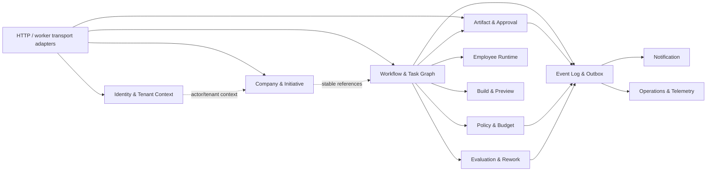

# ADR-001: MVP System Architecture

**Status:** Proposed system architecture; durable workflow selection is governed by proposed ADR-006 pending AICO-002 owner acceptance
**Date:** 2026-08-12  
**Owners:** Software Architecture + Backend Engineering  
**Decision horizon:** Private-alpha MVP  
**Authoritative inputs:** `../../../docs/product/SRS.md`, `../../../docs/product/MVP_SCOPE.md`, `../../../docs/delivery/BACKLOG.md`

## 1. Decision

AI Company OS will begin as a **domain-modular NestJS monolith** built once and run as two independently deployable processes:

- **Control API:** authenticated, versioned HTTP command/query surface; never executes long-running agent or build work in a request.
- **Workflow Worker:** durable task claiming, orchestration, policy-checked dispatch, provider/tool integration, and outbox publication.

PostgreSQL is the transactional source of truth for company state, workflow state, immutable artifact metadata, policy decisions, budgets, idempotency records, the ordered run event log, and the transactional outbox. Blob content is stored behind a tenant-aware object-store port; the local implementation is S3-compatible storage. A generated build runs behind a separate sandbox boundary and a preview is served from a separate origin. Neither generated code nor model output is trusted to mutate authoritative state directly.

For the MVP, durable scheduling and event publication are PostgreSQL-backed. Claims use short leases and `FOR UPDATE SKIP LOCKED`; every material state mutation and its outbox record commit in one database transaction. At-least-once processing is therefore expected, and all consumers must deduplicate by stable command/event/idempotency identifiers. A later workflow engine or broker may replace the scheduler and publisher through ports without changing domain state machines or public contracts.

This architecture is intentionally a modular monolith, not a distributed monolith: modules own their data and expose application ports; a module may not query another module's tables or inject another module's ORM repository.

## 2. Decision drivers and immutable constraints

1. A founder decision, artifact publication, or workflow transition must have RPO 0 at the PostgreSQL transaction boundary.
2. A worker restart must not lose a human wait, task, retry, cancellation, event, or budget reservation; continuation must be reconstructable without process memory.
3. Tenant identity is resolved from authenticated context, not accepted as authority from path, body, task payload, object key, or model output.
4. Only validated commands and typed outputs can affect state. Free-form model prose, logs, analytics, and progress text are non-authoritative.
5. Founder gates bind to an exact immutable artifact version and expected run state; approvals are append-only.
6. Policy is default-deny and evaluated against current persisted state immediately before each privileged action.
7. Long-running work, provider calls, and sandbox commands never hold an API request or database transaction open.
8. The MVP must run locally with Docker and deterministic fixtures, while retaining production seams for managed PostgreSQL, object storage, identity, model providers, isolated execution, telemetry, and preview hosting.
9. The system must remain operable by a small team. Extra network services must justify a capability PostgreSQL and process isolation cannot safely provide.

## 3. Scope of this decision

This ADR selects the control-plane decomposition, module boundaries, transactional boundaries, data ownership, trust boundaries, and evolution seams. It does not select:

- the final identity provider;
- the final model provider or model portfolio;
- the production sandbox technology;
- preview CDN/hosting vendor;
- final retention durations and alpha budget values; or
- detailed agent context, policy rule, and task-envelope schemas.

Those decisions must conform to this ADR and the SRS. The separate agent-runtime, backend platform, and AEO-foundation decisions refine their respective areas.

## 4. System context

The Founder Web App is a client of the Control API, not part of the backend repository. Model providers, generated code, preview content, and browser-supplied tenant identifiers remain outside the authoritative trust zone.

## 5. Container architecture

### 5.1 Deployable process responsibilities

| Process | May do | Must not do |
|---|---|---|
| Control API | Authenticate; resolve actor/company; validate DTOs; authorize founder/operator commands; commit short transactions; return persisted views and command receipts | Invoke a model; execute generated code; wait for a workflow stage; publish from uncommitted state; trust caller-supplied tenant authority |
| Workflow Worker | Claim leased durable work; evaluate policy/budget; assemble exact-version context; invoke approved adapters; validate outputs; commit results/transitions/outbox; publish outbox | Expose a public port; infer approval from model output; hold a transaction during an external call; run arbitrary shell in its own container |
| Migration job | Apply one reviewed, forward-compatible migration batch and exit | Start application traffic; race multiple migration writers; silently auto-sync schemas |
| Sandbox Manager | Materialize a single run workspace; enforce manifest, resources, egress, credentials, allowlisted commands, termination; return bounded evidence | Read founder sessions; connect to control-plane database; access another workspace; decide workflow or approval state |
| Preview Service | Serve checksum-verified successful output on isolated origin with expiry/revocation and prototype labeling | Receive control-plane cookies; call private APIs; execute with control-plane credentials |

API and worker use the same versioned application image and configuration schema but separate entry points. They can be scaled, restarted, or rolled back independently as long as their workflow/event/schema compatibility window is preserved.

## 6. Component and module boundaries

### 6.1 Required module contract

Each feature module contains four directional layers:

1. **Domain:** entities/value objects, state transition rules, reason codes, and domain events; no NestJS, ORM, HTTP, provider, or filesystem dependency.
2. **Application:** explicit command/query use cases and ports; opens transaction scopes and coordinates domain objects.
3. **Infrastructure:** PostgreSQL repositories, object/provider/sandbox implementations, outbox/lease code, telemetry adapters.
4. **Interface:** versioned REST controllers, worker handlers, DTO/schema validation, error mapping.

Allowed dependencies point inward. Shared code is limited to stable primitives such as IDs, clocks, transaction context, pagination, idempotency, result/error types, and telemetry context. A general `common` module must not become a home for cross-domain business logic.

### 6.2 Module ownership

| Module | Owns | Publishes/accepts through ports |
|---|---|---|
| Identity & Tenant Context | founder identity mapping, company ownership resolution, operator role separation | `ActorContext`, `TenantContext`; authentication/authorization failures |
| Company & Initiative | companies, immutable profile versions, prototype initiatives, goal versions, context snapshots | company/profile/initiative commands and version references |
| Workflow & Task Graph | runs, tasks, edges, task attempts, checkpoints, claims, retry/cancel state | versioned workflow commands; task-ready/blocked/stage events |
| Artifact & Approval | artifact identities, immutable versions, lineage, checksums, approvals, final/export manifests | publish artifact; exact-version founder decision; content-reference resolution |
| Policy & Budget | policy versions/decisions, action grants, budget ledger reservations/settlements | reason-coded allow/deny; reserve/settle/release |
| Employee Runtime | employee definitions, typed invocation attempts, output-schema validation, provider metadata | execute typed employee task; classified result/failure |
| Build & Preview | workspace/build/source metadata, command evidence, preview metadata and expiry | execute manifest; publish/revoke preview; never owns run state |
| Evaluation & Rework | evaluations, criterion verdicts, findings, rework selections | QA result and finding-linked rework request |
| Notification | idempotent founder notification records and delivery status | consumes committed audience-safe events |
| Event Log & Outbox | ordered run events, outbox delivery state, consumer inbox/deduplication | append-in-transaction; claim/publish/ack; ordered query |
| Operations & Telemetry | redacted audit projections, metrics/traces, kill requests | consumes safe events; issues separately authorized kill command |

## 7. Data ownership and integrity

### 7.1 Authoritative versus derived data

| Class | Examples | Authority and mutation rule |
|---|---|---|
| Transactional company state | company/profile, initiative/run, task/attempt, approval, budget, policy decision | Authoritative; only application use cases may mutate through validated state transitions |
| Immutable version records | goal, context snapshot, artifact version, employee/workflow/policy/rubric/template versions | Append-only; referenced by stable ID/version; correction creates a new version |
| Ordered event history | per-run event sequence, correlation/causation, audience-safe payload | Append-only and committed with material state; never reconstructed only from logs |
| Blob content | attachments, artifact bodies, source/build/QA/export blobs | Immutable by content/version reference and checksum; metadata lives transactionally in PostgreSQL |
| Derived projections | run summary, notification, analytics projection, search index | Rebuildable from authoritative state/events; cannot authorize transitions |
| Ephemeral/diagnostic | worker heartbeat, cache, raw bounded logs, traces, progress narration | Operational only; must never imply a successful transition |

### 7.2 Database ownership rules

- Every tenant-owned aggregate carries `company_id`; descendant records use composite tenant-aware foreign keys where practical so an invalid cross-company relation fails in the database.
- Public identifiers are opaque UUIDs. Sequence numbers are meaningful only within their parent aggregate, such as `(run_id, sequence)` and `(artifact_id, version)`.
- Date/time values are UTC `timestamptz`; state and reason values are validated domain enums/codes.
- Immutable tables reject update/delete through application repository interfaces. Administrative deletion follows a separately audited retention workflow.
- Database constraints enforce one active prototype initiative per company, unique idempotency scope, unique task attempt, unique artifact version, acyclic graph validation at application boundary, and terminal-state immutability through guarded transitions.
- Row locks are held only around state checks and writes. Provider, object, and sandbox calls occur outside database transactions using durable intent/attempt records.
- Application authorization is mandatory. PostgreSQL row-level security is defense in depth before external alpha, using transaction-local actor/company context; worker roles receive only the narrowly required bypass path and must still issue tenant-scoped repositories.

### 7.3 Transaction patterns

**Command transaction**

1. Resolve actor and tenant server-side.
2. Load idempotency record and current aggregate using tenant scope.
3. Validate expected state/version and policy.
4. Apply the domain transition.
5. Append immutable decision/version records as required.
6. Allocate the next run sequence and append an audience-safe event.
7. Insert an outbox item and command result.
8. Commit once; only then return an acknowledgement.

**Asynchronous attempt**

1. In a short transaction, claim an eligible task with lease, create/resume one attempt, and reserve budget.
2. Outside the transaction, assemble exact-version input and invoke one adapter with timeout/cancellation.
3. In a new short transaction, verify lease/expected state/idempotency, settle budget, persist classified result, transition state, append event/outbox, and commit.
4. A stale lease holder may record diagnostics but may not commit a duplicate side effect or overwrite a newer attempt.

**Outbox publication**

1. Claim unpublished rows with `FOR UPDATE SKIP LOCKED` and a short publish lease.
2. Publish/dispatch with stable `event_id` and schema version.
3. Mark delivered or schedule bounded retry.
4. Consumers store processed `event_id`/consumer keys before creating non-idempotent effects.

## 8. Trust boundaries and enforcement

| Boundary | Untrusted input | Required enforcement | Evidence |
|---|---|---|---|
| Browser -> API | tokens, IDs, payloads, idempotency keys, expected versions | token/session validation; server-side tenant resolution; DTO limits; ownership; optimistic concurrency; rate/size limits | request correlation, safe audit event, contract/security tests |
| Operator -> API | support identity and exceptional command | separate audience/role; redacted diagnostic query; reason/ticket for kill; no founder gate authority | immutable operator audit record |
| Worker -> model | assembled prompt/context and provider response | allowlisted exact versions; content/redaction policy; schema validation; time/cost limits; classified failure | attempt manifest and provider metadata, not hidden reasoning |
| Worker -> tool/sandbox | tool request or build manifest | fresh parameter-bound policy allow; budget reservation; workspace/resource/egress/secret isolation | policy decision, tool invocation, bounded command evidence |
| App -> object store | tenant key/ref, upload/download | canonical key builder; content type/size/safety; checksum; signed short-lived access; no arbitrary key passthrough | object metadata and audited access event |
| Preview -> browser | generated HTML/JS/assets | separate registrable origin; no control cookies; restrictive headers; expiry/revocation; no private API CORS | isolation test and preview metadata |
| Events -> UI/analytics/logs | domain payloads | audience/data-classification schema; allowlist/redaction; no prompts, source bodies, secrets, or foreign tenant fields | schema tests and secret-seeding tests |

Non-disclosing authorization errors use the same external status/reason family for missing and foreign resources. Internal telemetry can distinguish them without exposing foreign existence.

## 9. Durable workflow semantics

- Workflow definitions are immutable and identified by `workflow_version` on each run. A run never silently upgrades.
- Checkpoints store stage, resumable state, pending input/gate identity, exact artifact/context references, and applicable policy version.
- Task readiness is derived from persisted predecessor states, gate approvals, current policy, budget availability, and run cancellation—not from queue presence.
- Human waits have no active worker claim. The founder command transaction records the answer/decision and creates the next durable intent exactly once.
- Retries use independent counters and policies for transient execution, schema repair, founder recovery, and QA rework. The two-cycle QA limit is not a generic task retry count.
- Cancellation first prevents new claims, then records cancellation intent for in-flight execution. Late results fail the expected-state/lease check and cannot revive a terminal run.
- Workflow/event handlers are replay-safe. The database state, not event arrival order alone, determines whether a transition remains legal.

## 10. API and error contract

- Public APIs are under `/api/v1`; transport DTOs do not expose ORM entities.
- Every mutating command requires an `Idempotency-Key`. Harmful stale operations also require expected state/version in the body or conditional header.
- A successful asynchronous command returns persisted identity/state and a correlation ID, not a claim that downstream work completed.
- Errors use a stable envelope: `code`, `message`, `correlationId`, optional field issues, and safe remediation. Stack traces, provider bodies, policy internals, and foreign resource existence are never returned.
- Read models derive status from persisted state/timestamps and expose working, waiting, blocked, failed, canceled, and complete distinctly.
- Pagination is cursor-based where order must remain stable, particularly the per-run event stream.

## 11. Observability and operational controls

- OpenTelemetry-compatible trace/span context and structured JSON logs carry correlation, causation, run, task, attempt, process, and version fields where authorized.
- Logs use field allowlists/redaction. Artifact bodies, prompt/completion bodies, credentials, source bodies, and attachment contents are prohibited.
- Required metrics include API latency/error rate, database pool/transaction latency, claim/queue age, lease expiry, retry count, workflow block/failure rate, outbox lag, provider failure/latency/cost, budget exhaustion, build result, and policy denial/security signals.
- Liveness proves the process event loop is responsive. Readiness proves required config and PostgreSQL access; optional/degraded dependencies are reported separately.
- Graceful shutdown stops new HTTP/claim work, completes or releases bounded in-flight work, records cancellation/checkpoint state where required, closes pools, and exits within an enforced deadline.
- The operator kill path is an audited command that blocks dispatch and requests execution termination; it never writes an approval or artifact.

## 12. Failure modes and required behavior

| Failure | Detection | Required behavior | Forbidden outcome |
|---|---|---|---|
| API dies before commit | connection loss/transaction abort | client retries same idempotency key; no state/event exists | partial approval or orphan event |
| API dies after commit before response | missing response with persisted command result | retry returns original result | duplicate decision/transition |
| Worker dies with lease | heartbeat/lease expiry | another worker reclaims after visibility timeout; attempt remains auditable | local-memory-only loss or parallel commit |
| Outbox publish fails | delivery status/age | retry stable event ID; alert on lag | missing material event |
| Consumer receives duplicate | inbox/dedupe collision | return prior result/no-op | duplicate notification, task, or charge |
| PostgreSQL unavailable | readiness and operation error | API not ready or safe dependency error; worker stops new claims; backoff | success acknowledgement without commit |
| Object upload succeeds, metadata commit fails | orphan scanner/staging expiry | object remains staged and is garbage-collected; no published version points to it | mutable or unreferenced object treated as artifact |
| Provider times out or returns malformed output | adapter timeout/schema validation | classify; bounded retry/repair; settle budget; persist visible state | prose mutates company state |
| Budget/policy changes during external work | final expected-state/policy check | reject late result or block according to policy; audit disposition | side effect outside the exact grant |
| Cancel races with task result | row lock/expected state | one legal terminal/next transition wins; late result cannot dispatch more work | canceled run resumes |
| Migration incompatible with old process | deployment compatibility check | expand/migrate/switch/contract; hold rollout or roll back app | unreadable historical run |
| Suspected sandbox escape | security signal/runner termination | terminate execution, revoke credentials, block run, alert operator | automatic unsafe retry |

## 13. Evolution seams

| Current MVP choice | Extraction trigger | Stable seam |
|---|---|---|
| PostgreSQL task claims | sustained claim contention, independently scaled job classes, or workflow semantics exceed the proven state machine | `WorkflowSchedulerPort`; immutable workflow/task/checkpoint contracts |
| PostgreSQL outbox publication | external consumers, regional fan-out, or throughput exceeds DB publisher target | `EventPublisherPort`; versioned event envelope and consumer inbox |
| Modular monolith modules | independent security/scaling/ownership need outweighs transaction simplicity | application ports and owned schemas; no cross-module table access |
| S3-compatible object adapter | retention/legal/region needs require specialist stores | content-addressed `ObjectStorePort` and immutable metadata reference |
| One model adapter process | provider isolation, throughput, or provider-specific failure domains justify separation | typed provider request/result envelope |
| Sandbox Manager adapter | production isolation platform selected | execution manifest/result protocol; no control-plane DB dependency |
| Polling run updates | event freshness or client load requires push | ordered event cursor supports SSE/WebSocket projection without changing authority |

Extraction must not weaken exact-version approvals, tenant boundaries, audit sequence, or transactionally recorded intent.

## 14. Alternatives considered

| Alternative | Advantages | Why not selected for MVP |
|---|---|---|
| Microservices from day one | independent scaling and deployment | creates distributed transaction, schema, local orchestration, and operational cost before bounded alpha demand exists |
| Temporal as first workflow engine | excellent durable workflow semantics and operator tooling | adds a second persistence/control system and deterministic workflow constraints before the team has validated the fixed product flow; retained as an evolution option |
| Redis/BullMQ as system of workflow record | familiar NestJS queue and fast dispatch | does not remove the need for PostgreSQL authority/outbox and makes human waits, exact state coupling, and recovery span two stores |
| In-process event emitter/cron only | minimal dependencies | loses durable work/events on crash and cannot meet restart/idempotency requirements |
| Database per tenant | strongest physical separation | operationally disproportionate for one-founder private alpha; app scope + constraints + RLS provide MVP defense in depth |
| ORM entities shared across modules | rapid initial coding | couples business rules/storage and enables cross-domain table access, making extraction and invariant testing unsafe |
| Store artifacts in PostgreSQL only | one transaction system | large source/build/export objects inflate backup and database costs; immutable metadata plus staged object promotion preserves lineage |

## 15. Requirement and GitHub issue traceability

| Decision area | SRS / MVP coverage | GitHub work |
|---|---|---|
| Product-to-delivery baseline | SRS §§2–5, MVP-CAP-001–012 | AICO-001 |
| Durable state, human waits, retry/cancel, outbox | TD-001, TD-006; SRS-FR-033–045, 074–083; NFR-006–008 | AICO-002, AICO-023–029, AICO-084 |
| Tenant/object/retention boundary | TD-002, TD-006, TD-009; SRS-FR-001–012, 092; NFR-008–016 | AICO-003, AICO-011–017, AICO-076, AICO-082 |
| Sandbox/template/dependency boundary | TD-003, TD-004; SRS-FR-048–058; NFR-011, 025–026 | AICO-004, AICO-047–056, AICO-083 |
| Provider abstraction | TD-005; SRS-FR-084, 089–091 | AICO-005, AICO-030, AICO-032 |
| Policy/exact-version approval | TD-007; SRS-FR-021–031, 085–088 | AICO-006, AICO-031, AICO-039–045 |
| Preview separation | TD-008; SRS-FR-059–060; NFR-014 | AICO-007, AICO-057–058, AICO-083 |
| Bounded alpha operation | TD-010; SRS-FR-095; NFR-004, 025–027 | AICO-008, AICO-033, AICO-080 |
| Repository/deployment baseline | SRS §12; NFR-020–024 | AICO-009, AICO-079, AICO-085 |
| Control plane, storage, configuration, health | CMP-02–10, CMP-15; NFR-005–010 | AICO-010 |

## 16. Implementable acceptance checks

The baseline is accepted only when automated checks demonstrate all of the following:

1. A single documented Docker command builds the image, applies the initial migration through a one-shot job, starts PostgreSQL/object storage/API/worker, and reports API liveness and dependency readiness separately.
2. API and worker start from the same commit/image with different NestJS entry points; the worker exposes no public application port.
3. Killing the worker after a task claim and restarting it causes the lease to expire/recover and produces one logical result/event, with no process-memory reconstruction.
4. Injecting failure immediately before and after a command commit demonstrates zero partial state and idempotent return of the committed result.
5. Injecting outbox publish failure and duplicate delivery yields a complete ordered event history and one consumer side effect.
6. Two-company fixtures prove foreign IDs fail in company/run/task/artifact/object/model-context queries with non-disclosing responses; tenant is resolved server-side.
7. A stale or duplicate founder approval, wrong artifact version, employee/operator approval attempt, and approval after cancel all produce zero state/tool side effects.
8. Model output that is malformed, free-form only, or requests an unauthorized tool cannot mutate state; a classified attempt and policy/validation event are persisted.
9. Cancellation racing a task completion leaves the run terminal `CANCELED`, prevents further claims, and records final in-flight disposition.
10. A migration up/down smoke test and production build run in CI without schema auto-synchronization or paid external services.
11. Structured logs and events pass a secret/content-seeding test proving no credentials, raw prompt/completion bodies, source bodies, attachment bodies, or other-company identifiers escape their audience.
12. An old workflow version remains readable and resumable or accurately blocked after deploying a compatible newer application version.

## 17. Consequences

### Positive

- Strong transaction semantics cover the highest-risk MVP invariants with one authoritative store.
- API and worker failure domains/scaling are separated without introducing premature service networking.
- Durable human gates and agent execution are explicit state, not hidden inside chat sessions or worker memory.
- Module ownership and ports preserve a practical path to later services, broker, or workflow engine.
- Local Docker behavior closely resembles the production process topology.

### Costs and obligations

- PostgreSQL claim/outbox indexes, lease semantics, transaction length, and vacuum behavior require measurement.
- Every side-effecting handler must be deliberately idempotent; at-least-once delivery cannot be treated as exceptional.
- Defense-in-depth tenant enforcement adds migration, repository, and negative-test work.
- The team must maintain backward-compatible workflow/event/schema versions during rolling deployment.
- Sandbox and preview isolation remain separate security projects; Docker Compose alone is not evidence of production isolation.

## 18. Review gates

- **Before Sprint 1:** prove pause/restart/resume and duplicate delivery; approve initial schema/data ownership.
- **Before build capability:** approve and adversarially test the sandbox execution boundary and dependency policy.
- **Before external alpha:** enable/test RLS defense in depth, set retention/budget/capacity values, complete restore/rollback/isolation drills, and review this decision against observed queue/outbox load.
