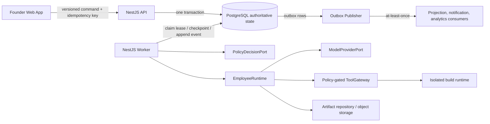

# ADR-002: Governed Multi-Agent Runtime and Durable Orchestration

- **Status:** Accepted for the first MVP
- **Date:** 2026-08-12
- **Owners:** Multi-Agent Systems Architecture, Backend Engineering
- **Decision scope:** AICO-002, AICO-005, AICO-006, AICO-022 through AICO-033
- **Product trace:** MVP-CAP-003 through MVP-CAP-006, MVP-CAP-008, MVP-CAP-010 through MVP-CAP-012; SRS-FR-013 through SRS-FR-045, SRS-FR-061 through SRS-FR-069, SRS-FR-074 through SRS-FR-095; SRS-NFR-006 through SRS-NFR-007, SRS-NFR-020 through SRS-NFR-027; TD-001, TD-005 through TD-007, TD-010

## 1. Decision

The MVP uses a **governed, fixed-role runtime** rather than an open-ended agent society. Exactly four versioned employee definitions may execute:

| Key | Role | May produce | Explicitly may not do |
|---|---|---|---|
| `EMP-PM` | Product Manager | Qualification, clarification request, Product Brief, bounded revision | Approve, edit code, invoke build tools, silently narrow founder scope |
| `EMP-DES` | Designer | Design Specification and bounded revision | Add product scope, edit code, approve, invoke build tools |
| `EMP-ENG` | Engineer | Task plan, source snapshot, build/test result, bounded rework | Deploy, use unrestricted network, read secrets, change approved scope, approve |
| `EMP-QA` | Reviewer/QA | QA Report, criterion verdicts, findings, rework recommendation | Edit source or requirements, waive a required failure, fabricate evidence, approve |

Employees do not communicate through free-form chat. They exchange immutable, schema-valid artifacts and task results through an authoritative PostgreSQL task graph. Every task attempt is pinned to exact workflow, employee, instruction, schema, policy, rubric, tool, provider/model configuration, and input artifact versions.

The first implementation is a **NestJS modular monolith with two process roles**:

- the API accepts authenticated commands and serves persisted projections;
- the worker advances orchestration, invokes employees/providers/tools, and publishes outbox events.

PostgreSQL is the source of truth for runs, tasks, attempts, waits, approvals, artifacts, budgets, policy decisions, ordered events, the transactional outbox, consumer inboxes, and leases. No worker-local state is required to recover a run. An external workflow engine or message broker is not required for the first MVP. `WorkflowSchedulerPort`, `EventPublisherPort`, and `ModelProviderPort` preserve a substitution boundary if alpha load or operating evidence later justifies Temporal, a broker, or another model provider.

## 2. Why this decision

The product requires long human waits, exact-version approvals, RPO 0 at the PostgreSQL commit boundary, safe process restarts, ordered audit history, and only one active run per company. Alpha throughput is secondary to correctness and inspectability. A PostgreSQL-backed orchestration loop minimizes distributed transaction failure modes: state change, budget reservation, approval, event sequence assignment, and outbox insertion can share one transaction.

This is not a claim that PostgreSQL is a universal workflow engine. It is a deliberately bounded choice for one fixed workflow and alpha concurrency. Migration triggers are documented below.

## 3. Runtime boundaries

Recommended NestJS module boundaries:

- `RunsModule`: run aggregate, legal transitions, checkpoints, cancellation.
- `TaskGraphModule`: task-plan validation, dependency readiness, additive rework graph.
- `OrchestrationModule`: scheduling port, leases, dispatch, retry and recovery policies.
- `EmployeesModule`: immutable definitions and version resolver.
- `AgentRuntimeModule`: context assembly, provider invocation, output validation and repair.
- `PolicyModule`: current-state contextual authorization and recorded decisions.
- `BudgetsModule`: atomic reservation, reconciliation, hard-limit enforcement.
- `ArtifactsModule`: immutable artifact versions, checksums, lineage, publication.
- `EventsModule`: per-run sequencing, domain events, outbox and inbox deduplication.
- `ApprovalsModule`: founder-only, exact-version, append-only gate decisions.
- `EvaluationsModule`: criterion verdicts, findings, QA and rework-cycle rules.

Domain/application code depends on ports, not TypeORM, a provider SDK, a queue library, or a sandbox SDK. Infrastructure adapters live at module edges.

## 4. Authoritative workflow

### 4.1 Workflow version

Each run pins a `workflowVersion` at creation. For MVP version `prototype-run/v1`, the stage order is:

1. qualify goal with `EMP-PM`;
2. optionally wait for typed founder clarification;
3. produce and gate the Product Brief;
4. produce and gate the Design Specification;
5. materialize the implementation task plan;
6. build with `EMP-ENG` in an isolated workspace;
7. evaluate with `EMP-QA`;
8. if blocking findings exist, run at most two additive Engineer/QA rework cycles;
9. gate the exact final candidate;
10. complete and allow export.

Workflow upgrades create a new immutable definition. An in-progress run continues on its pinned version unless an explicit, tested compatibility migration is recorded. Historical state is never rewritten to look like a newer workflow.

### 4.2 Run transitions

Only the transition service may change run state. It performs an optimistic state check and commits the transition with its event and outbox record.

| From | Permitted destinations |
|---|---|
| `DRAFT` | `QUALIFYING`, `CANCELED` |
| `QUALIFYING` | `AWAITING_FOUNDER_INPUT`, `AWAITING_BRIEF_APPROVAL`, `BLOCKED`, `FAILED`, `CANCELED` |
| `AWAITING_FOUNDER_INPUT` | persisted resumable state, `CANCELED` |
| `AWAITING_BRIEF_APPROVAL` | `DESIGNING`, `QUALIFYING`, `CANCELED` |
| `DESIGNING` | `AWAITING_DESIGN_APPROVAL`, `BLOCKED`, `FAILED`, `CANCELED` |
| `AWAITING_DESIGN_APPROVAL` | `BUILDING`, `DESIGNING`, `CANCELED` |
| `BUILDING` | `REVIEWING`, `BLOCKED`, `FAILED`, `CANCELED` |
| `REVIEWING` | `REWORKING`, `AWAITING_FINAL_APPROVAL`, `BLOCKED`, `FAILED`, `CANCELED` |
| `REWORKING` | `REVIEWING`, `BLOCKED`, `FAILED`, `CANCELED` |
| `AWAITING_FINAL_APPROVAL` | `COMPLETED`, `REWORKING`, `CANCELED` |
| `BLOCKED` | persisted checkpoint state, `FAILED`, `CANCELED` |
| `FAILED`, `CANCELED`, `COMPLETED` | none |

Every transition records source, destination, trigger, actor, workflow version, correlation/causation identifiers, and applicable gate/policy/approval references. `FAILED`, `CANCELED`, and `COMPLETED` are terminal.

### 4.3 Task graph and states

The task plan is a versioned acyclic directed graph. A validator rejects missing nodes, cross-run edges, self-edges, cycles, unknown task/employee/output types, duplicate logical keys, and stage-invalid dependencies. Rework only appends new tasks and edges; it never edits a succeeded task or its attempt.

Task states are `QUEUED`, `READY`, `RUNNING`, `AWAITING_INPUT`, `RETRY_WAIT`, `SUCCEEDED`, `BLOCKED`, `FAILED`, and `CANCELED`. Readiness is derived and then revalidated at claim time:

- every required predecessor succeeded;
- every referenced artifact version is still the selected approved version;
- the run is non-terminal and in the permitted stage;
- no cancellation or kill is effective;
- current policy allows dispatch;
- budget can be atomically reserved.

The worker does not trust a previously stored `READY` flag as authorization.

## 5. Claim, lease, dispatch, and checkpoint

The worker claims eligible tasks in a short transaction using row locking (`FOR UPDATE SKIP LOCKED`) and a renewable lease. Claiming:

1. rechecks run/task state, dependencies, approvals, policy preconditions, and cancellation;
2. atomically reserves the estimated budget;
3. increments `attempt_count`, creates the `TaskAttempt`, and stores its immutable input manifest;
4. writes `lease_owner`, `lease_token`, and `lease_expires_at`;
5. changes the task to `RUNNING` and appends the ordered event/outbox row.

Slow model or tool execution occurs outside the database transaction. Completion requires the same attempt ID and lease token. A stale worker cannot commit after its lease is lost. The completion transaction validates output, publishes immutable artifact versions if applicable, reconciles actual budget usage, updates task/run state, and appends events/outbox rows.

Lease expiry does not imply that an external side effect did not occur. Recovery first inspects persisted invocation records using their stable provider/tool idempotency keys. If outcome cannot be established safely, the task becomes `BLOCKED` rather than being blindly replayed.

The recovery scan claims expired non-terminal attempts, classifies them, and either records the already-committed logical result, schedules a bounded retry, or blocks the run. This provides the SRS restart target without depending on worker memory.

## 6. Human waits and approvals

A human wait is an explicit persisted checkpoint, not a sleeping process or an unacknowledged queue message. It contains the run and task, request ID/version, expected response schema, reason codes, prior state, resumable state, context snapshot, and relevant version set.

The founder-answer command requires founder identity resolved server-side, company ownership, exact open request/version, expected run state, schema-valid content, and a unique idempotency key. The command transaction creates an immutable answer version, closes exactly one wait, restores the persisted resumable state, and emits one event/outbox row. Duplicates return the original command result.

Approvals use the same rule but bind the decision to the exact pending artifact version. An employee or operator cannot approve. A stale version, wrong gate, wrong tenant, terminal run, repeated decision, or state mismatch denies with zero transition side effect.

## 7. Employee definitions and context assembly

An `EmployeeDefinitionVersion` is immutable and includes:

- fixed employee key and role;
- instruction/skill bundle version and digest;
- input/output schema versions;
- allowlisted tool/action grants and explicit prohibitions;
- memory scope and field allowlist;
- evaluation rubric version;
- provider capability requirements;
- per-attempt limits and repair policy;
- activation status and rollout metadata.

A run pins a default definition version set. Every attempt stores the resolved version again so history remains explainable after rollout or rollback.

`ContextAssembler` builds a manifest from references, not conversation history. It may include the frozen company/context snapshot, exact approved artifact versions required by the task, task objective, bounded prior findings, applicable rubric/policy/tool descriptions, and remaining budget. It must exclude:

- other companies and other runs unless a future policy explicitly permits a non-content fixture;
- mutable `latest` artifacts;
- arbitrary previous transcripts;
- credentials, control-plane secrets, and private infrastructure details;
- raw hidden reasoning;
- fields not allowed by the employee definition and task schema.

The serialized context is size-limited, redacted, canonicalized, and hashed. The attempt stores the manifest and digest; large permitted content remains in tenant-scoped object storage and is retrieved by exact reference.

## 8. Provider abstraction and structured output

`ModelProviderPort.invoke(request, signal)` receives a provider-neutral request containing employee/task envelopes, exact version set, structured messages/content parts, declared tools, required output schema, timeout, and token/cost ceiling. It returns a provider-neutral result with parsed candidate output, finish reason, provider/model/configuration identifiers, token usage, attributable cost, latency, safety/redaction result, provider request ID, and retryability classification.

Provider adapters may use provider-native structured output, but the runtime independently validates the result against the pinned schema. Invalid output has no authority and creates no artifact or state transition. The runtime may perform a bounded repair attempt using validation errors only; repair uses a new attempt/invocation record and budget reservation. Schema-invalid output after the limit becomes a classified `VALIDATION` failure and normally blocks the run.

The model may propose tool requests, but it never invokes tools directly. Each request crosses `ToolGateway`, which obtains a fresh, versioned, parameter-bound policy decision before any side effect.

## 9. Policy-before-tools

Policy input includes employee definition version, founder/system actor, company, run, task, attempt, current stage/state, action, resource/tool and exact parameters, approval references, budget state, environment facts, and policy version. Missing, stale, unknown, or invalid input is deny.

An allow decision is narrow: it binds one attempt, action, resource/parameter digest, environment, policy version, and expiry. `ToolInvocation` must reference the matching unexpired allow decision. A deny is persisted and evented before returning a safe reason; no tool adapter is called. There is no session-wide authorization grant.

For the MVP, policies are deterministic application rules expressed behind `PolicyDecisionPort`, versioned as data/code releases. The port permits later adoption of a dedicated policy engine without changing orchestration semantics.

## 10. Budgets, retries, and timeouts

Budget categories include model tokens/cost, compute time, wall time, storage, file/output size, tool calls, transient retries, schema repairs, and rework cycles. Limits are versioned per run. Before dispatch or invocation, PostgreSQL atomically moves capacity from `available` to `reserved`; completion reconciles reserved to consumed. Reservation uses row locking or a conditional atomic update so concurrent workers cannot oversubscribe.

Every model/tool/build call has a hard deadline and an abort signal. Retry policy is based on classified failure, not generic exceptions:

| Class | Default action |
|---|---|
| `TRANSIENT_PROVIDER`, `TRANSIENT_INFRA` | Bounded exponential backoff with jitter and stable logical idempotency key |
| `RATE_LIMITED` | Retry after provider hint within time/cost budget |
| `VALIDATION` | Bounded structured-output repair; then `BLOCKED` |
| `POLICY_DENIED` | No retry until relevant state/policy changes; expose safe reason |
| `BUDGET_EXHAUSTED` | Stop new dispatch, cancel eligible in-flight work, reconcile, then `BLOCKED` |
| `FOUNDER_INPUT_REQUIRED` | Persist wait; no automated retry |
| `NON_RETRYABLE_PROVIDER`, `SECURITY`, `INTEGRITY` | Fail closed; `BLOCKED` or terminal `FAILED` according to versioned policy |
| `CANCELED` | Stop and record cancellation; never retry |

Retries create a new attempt while retaining the task identity. A provider/tool logical operation retains a stable idempotency key where the adapter supports it. Backoff deadlines are persisted as `next_attempt_at`; no process timer is authoritative.

## 11. QA evaluation and bounded rework

`EMP-QA` receives exact approved Product Brief and Design Specification versions, the exact successful build/source versions, automated check evidence, rubric version, and cycle number. It emits one typed verdict per acceptance criterion plus findings and a recommendation. Missing required evidence is `blocked`, never inferred as pass.

Only unresolved blocking findings may create automatic rework. The rework planner appends scoped `EMP-ENG` tasks referencing the failed build, findings, exact criteria, permitted files/objective, and required regression checks. The next QA task depends on the new build. A cycle increments only after a complete Engineer/QA loop, not on retries within either task. After two completed automatic cycles, remaining blocking findings move the run to `BLOCKED`; they are not silently waived. Advisory findings remain visible but do not by themselves block final readiness.

## 12. Ordered events, outbox, and consumers

Material state and its domain event are written in one transaction. The transaction locks a per-run sequence row and assigns the next integer sequence. An event has a globally unique ID and unique `(run_id, sequence)`. The same transaction inserts an outbox record whose payload references the event.

The publisher claims outbox rows with `SKIP LOCKED`, publishes, and marks them delivered. A crash after publish and before acknowledgement causes replay; therefore delivery is at least once. Every side-effecting consumer maintains an inbox/deduplication record with unique `(consumer, event_id)` and commits the inbox record with its projection/notification mutation. Run-local consumers defer a gap until the preceding sequence arrives.

Founder-visible status is queried from persisted state and events, never worker presence. Public/founder event payloads contain concise conclusions, reason codes, references, timings, and safe metadata—not raw prompts, completions, source bodies, credentials, or hidden reasoning.

## 13. Cancellation and kill semantics

Founder cancellation is an idempotent terminal transition. It:

1. commits `CANCELED` and an ordered event;
2. prevents all future claims by state predicate;
3. marks queued/waiting/retryable tasks canceled;
4. places cancellation requests for active attempts and revocation records for temporary credentials/workspaces;
5. requires workers to abort at safe boundaries and reconcile consumed budget;
6. rejects late completion because the lease/run terminal check fails.

Operator kill is separately authorized and audited. It may stop unsafe execution and block a run, but it cannot create founder approvals, edit artifacts, or rewrite decisions. In a cancel/complete race, the first valid terminal transition wins under the run row lock; the loser returns the committed result/conflict and causes no second side effect.

## 14. Failure and recovery invariants

The runtime must preserve these invariants under duplicate delivery, process termination, and network timeout:

1. A model result, tool result, or prose response cannot mutate authoritative state without schema validation and an application transaction.
2. One idempotency key maps to one command result within its actor/company/command scope.
3. A task has at most one accepted successful logical outcome; stale leases cannot commit.
4. No privileged tool side effect occurs without a recorded matching allow decision.
5. Budget cannot be oversubscribed; reserved and consumed usage remains reconcilable.
6. Approval references one exact immutable artifact version and is founder-authored.
7. Every committed material transition has one ordered event and outbox record.
8. Delivery replay may repeat transport, never a logical side effect.
9. Terminal runs create no new task, wait, invocation, artifact, approval, or export work.
10. Recovery can reconstruct the next legal action from PostgreSQL plus referenced immutable objects.

Unknown external outcome is not treated as success or automatically repeated. It becomes a founder/operator-visible `BLOCKED` condition with correlation ID and safe recovery action.

## 15. Alternatives and migration triggers

### External workflow engine now

Temporal or another durable engine offers mature timers, activity retries, and workflow histories, but adds an operational dependency and creates a dual-authority risk unless product state and workflow history are carefully reconciled. The MVP's fixed workflow, low alpha concurrency, and need for transactional ordered events favor PostgreSQL first.

Reconsider when one or more are observed: sustained queue claim contention, more than the declared alpha concurrency, many parallel long-running activities per run, timer volume that makes database polling material, cross-service workflow ownership, or recovery logic becoming more complex than the product workflow. Migration implements `WorkflowSchedulerPort` against the new engine; PostgreSQL remains authoritative for product state, approvals, artifacts, policy decisions, and ordered audit events.

### Broker now

A broker is optional because the outbox worker can invoke internal consumers and adapters directly. Add one when fan-out, independent scaling, or integration latency requires it. The outbox remains the publication source; broker delivery stays at least once and consumers keep inbox deduplication.

### Free-form agent collaboration

Rejected for MVP. It makes permissions, causal traceability, budgets, outputs, and recovery ambiguous and conflicts with the fixed-team, typed-artifact product promise.

## 16. Verification

Required automated suites:

- contract fixtures for all envelope versions, strict unknown-field rejection, redaction, and round trips;
- exhaustive run/task transition tables including terminal-state rejection;
- graph cycle, cross-run, unknown-node, stale approval, and additive-rework tests;
- concurrent claim, expired lease, stale completion, and one-logical-success tests;
- duplicate command, answer, approval, event, and provider/tool result tests;
- fault injection immediately before/after database commit and external acknowledgement;
- worker restart during model invocation, human wait, build, evaluation, and rework;
- role/tool negative matrix and parameter-tampering tests;
- context leak fixtures for other tenants, mutable artifacts, transcripts, credentials, and hidden reasoning;
- budget boundary/oversubscription/reconciliation and timeout-abort tests;
- QA missing-evidence, blocking/advisory, regression, two-cycle cap, and no-waiver tests;
- cancellation versus claim/completion races and operator-authority separation.

## 17. Issue traceability

| Decision area | Backlog issues | Primary SRS trace |
|---|---|---|
| PostgreSQL orchestration, waits, restart, cancellation | AICO-002, AICO-026 through AICO-029 | SRS-FR-035 through 039, 074 through 083; NFR-006 through 007 |
| Typed envelopes and graph | AICO-022 through AICO-024 | SRS-FR-033 through 045; NFR-020, 023 |
| Ordered outbox/inbox | AICO-025 | SRS-FR-038 through 039; AT-006 |
| Employee definitions and scoped memory | AICO-030 | SRS-FR-084, 089, 091 through 092 |
| Policy-before-tools | AICO-006, AICO-031 | SRS-FR-035 through 036, 085 through 088 |
| Provider abstraction and typed output | AICO-005, AICO-032 | SRS-FR-013 through 016, 090 through 091 |
| Atomic bounded budgets | AICO-033 | SRS-FR-095; NFR-025 through 027 |
| Evaluation and rework semantics | AICO-024, AICO-032 through AICO-033 | SRS-FR-061 through 069 |

