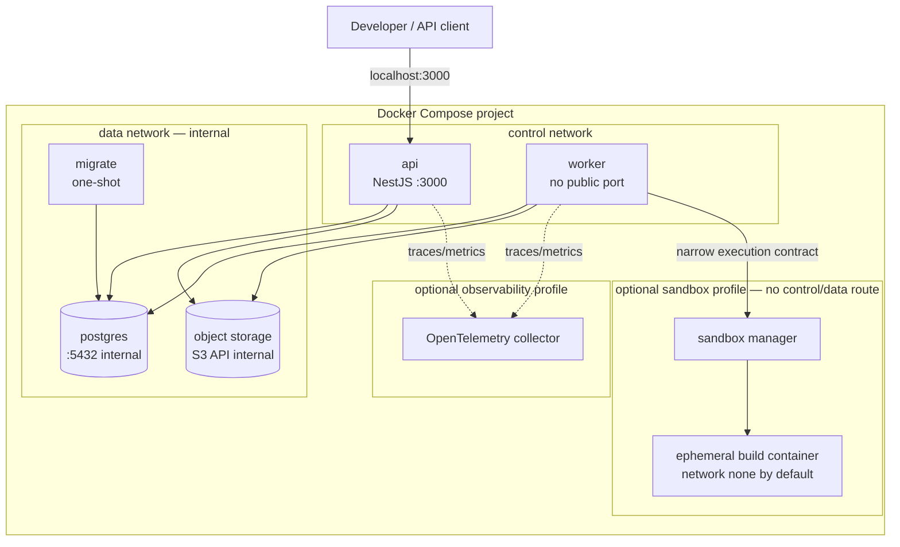
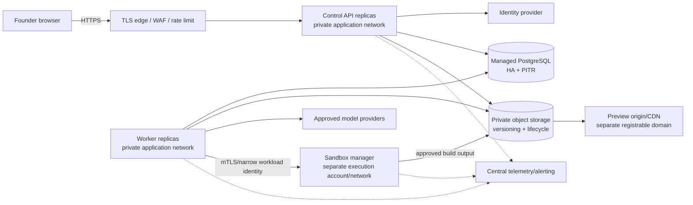

# ADR-004: Deployment Topology and Runtime Operations

**Status:** Proposed for MVP baseline  
**Date:** 2026-08-12  
**Owners:** Software Architecture + Platform Engineering  
**Related decision:** [ADR-001](./001-system-architecture.md)

## 1. Decision

The backend will ship as one versioned container image with three explicit, foreground entry points:

- `api` — NestJS HTTP control API;
- `worker` — NestJS workflow/outbox worker; and
- `migrate` — one-shot database migration command.

Local development uses Docker Compose with isolated services for PostgreSQL, S3-compatible object storage, API, worker, and the one-shot migration. Production uses equivalent managed data services and separately scaled API/worker workloads. Migration runs once before application rollout; application replicas never auto-synchronize the schema.

Build execution and generated preview serving are separate security zones. The API/worker image does not receive a host Docker socket, does not execute generated commands, and does not serve generated HTML from its origin.

## 2. Local Docker topology

### 2.1 Compose service contract

| Service | Startup/health | Persistence | Exposure |
|---|---|---|---|
| `postgres` | health check uses authenticated `pg_isready`; explicit database/user | named volume; local data is disposable by documented opt-in command only | no host port required by default; optional developer override |
| `object-store` | health endpoint plus bucket bootstrap job | named volume; versioning/retention behavior mirrors adapter contract | S3 port internal; console port optional in a development-only profile |
| `migrate` | waits for healthy PostgreSQL; applies reviewed migrations and exits 0 | none | none |
| `api` | waits for successful migration and required dependencies; `/health/live` and `/health/ready` | stateless | bind `127.0.0.1:3000:3000` locally |
| `worker` | waits for successful migration and required dependencies; process health/heartbeat | stateless; durable state in PostgreSQL | none |
| `otel-collector` | optional development profile | optional | local-only diagnostics ports |
| `sandbox-manager` | optional until build milestone; capability/security health | ephemeral workspace root outside control-plane files | narrow internal port; never public |

Compose startup ordering is convenience only. Every process must tolerate dependency restart and enforce its own retry/backoff/readiness behavior.

## 3. Production topology

### 3.1 Security zones

| Zone | Inbound | Outbound | Credentials/data allowed |
|---|---|---|---|
| Public edge | HTTPS from internet | API only | no database/object/model credentials |
| Control API | edge/load balancer; internal health | identity, PostgreSQL, object metadata/access, telemetry | API DB role, object role scoped to control operations; no sandbox root or model secret unless an explicit synchronous feature is approved |
| Worker | scheduler; no public inbound | PostgreSQL, object store, approved providers, sandbox manager, telemetry | worker DB role, scoped object/provider credentials; no founder session secret |
| Data | API/worker/migrate approved identities | backups/telemetry as managed | encrypted authoritative state and immutable object content |
| Sandbox manager | worker narrow protocol, operator kill | isolated execution control, staged object output, security telemetry | short-lived workload identity; no control DB access or founder/model production credentials |
| Ephemeral build | sandbox manager only | deny; optional platform-managed dependency cache route for setup only | run-scoped workspace/token with expiry; never control-plane identity |
| Preview | signed founder access or public policy as selected | static object fetch only; private control APIs denied | no control-plane cookies/credentials; immutable build only |
| Operations | telemetry emitters and separately authenticated operators | alerting/run kill through audited control | redacted metadata; no founder approval authority |

## 4. Image and process contract

One immutable image per commit contains compiled application code, database migration files, dependency lockfile provenance, and build metadata. Runtime selects only the entry point; it does not mutate the image.

Required image properties:

- pinned supported Node.js runtime and reproducible package lock;
- non-root application user and read-only root filesystem where platform allows;
- no compiler, package manager credentials, Docker socket, or generated source in the runtime image;
- minimal production dependencies, with test/build dependencies excluded from final stage;
- OCI labels for source revision, build timestamp, semantic/application version, and workflow/schema compatibility;
- init/signal handling that allows NestJS graceful shutdown;
- filesystem writes limited to an explicit ephemeral temp directory with size limit;
- container and dependency vulnerability scans in CI; release blocked on defined severity policy.

API and worker configuration is validated at boot through the same typed schema. Missing or malformed required values fail the process without logging the secret value.

## 5. Network and port policy

- Only the API edge port is public. PostgreSQL, object API, worker, migration, telemetry receivers, and sandbox-manager ports are private.
- Local API binds to loopback by default. Developer overrides that expose data/console ports are opt-in and must not be copied to production configuration.
- PostgreSQL accepts TLS in non-local environments and requires separate least-privilege runtime and migration roles.
- Object storage uses TLS, server-side encryption, bucket/key policy, versioning, lifecycle, and short-lived signed access where the browser needs direct transfer.
- API CORS uses an explicit control-plane origin allowlist with credentials only for the approved origin.
- Preview uses a separate registrable domain or equivalent isolated security context. It is absent from API CORS and cannot receive control-plane cookies.
- Worker provider egress is allowlisted by destination and credential scope. Build execution has no general egress.
- Service-to-service production calls use workload identity/mTLS or an equivalent short-lived authenticated channel.

## 6. Configuration and secrets

### 6.1 Configuration classes

| Class | Examples | Delivery |
|---|---|---|
| Non-secret invariant | environment, log level, API port, workflow/policy version targets, lease/retry limits | versioned deployment configuration |
| Secret | DB password/cert, object secret, provider API key, signing key | platform secret manager / mounted secret; never committed or baked into image |
| Dynamic policy | budgets, qualification limits, model/template rollout target, kill switches | versioned persisted configuration with authorized change/audit |
| Derived endpoint | database/object/provider URL | environment-specific configuration validated at startup |

Local development uses an ignored `.env` generated from a committed example containing only placeholders and safe local defaults. Production secrets are injected by workload identity/secret manager. Logs, crash reports, health output, and configuration-validation errors must redact values.

Secret rotation requirements:

- accept current and next keys during a bounded rollover window where protocol requires;
- make provider/object/signed-access credentials independently revocable;
- restart or hot-reload only through a documented mechanism;
- test seeded-secret absence in logs, events, analytics, artifacts, previews, and exports.

## 7. Database deployment and migration

### 7.1 Roles

| Role | Privileges |
|---|---|
| `aico_migrator` | schema migration privileges; no application traffic; available only to one-shot migration job |
| `aico_api` | execute approved runtime queries/functions for API-owned paths; tenant context required |
| `aico_worker` | runtime access required for claims, orchestration, outbox, and integrations; still tenant-scoped in repositories |
| `aico_readonly_ops` | redacted operational views only; no mutations or unrestricted artifact content |

### 7.2 Migration sequence

1. CI runs migration up on an empty database and on a snapshot of the prior supported schema.
2. CI runs application tests and a documented rollback/forward-recovery exercise.
3. Production backup/PITR health is verified and the migration job acquires an advisory lock.
4. Apply an **expand** migration compatible with current and new API/worker versions.
5. Deploy new API/worker version; target new workflow/model/template versions only after health checks.
6. Backfill through bounded observable jobs if required.
7. Apply a later **contract** migration only after old processes and historical readers no longer need the old shape.

Destructive or non-backward-compatible migration in the same rollout is prohibited. Automatic ORM schema synchronization is disabled in every environment.

## 8. Startup, health, and shutdown

### 8.1 API

- Boot validates configuration, initializes telemetry, opens the PostgreSQL pool, verifies required schema compatibility, then starts listening.
- `/api/v1/health/live` proves the process is responsive and does not query dependencies.
- `/api/v1/health/ready` checks required database access/schema compatibility and reports object-store/provider dependencies as required or degraded according to enabled capabilities.
- On termination, stop accepting connections, finish bounded requests, close pools/exporters, and exit before the platform grace deadline.

### 8.2 Worker

- Boot validates config/schema and begins claim loops only after required dependencies are ready.
- A process heartbeat reports liveness; durable task leases remain the authority for work ownership.
- On termination, stop claims, signal provider/sandbox cancellation where supported, finish or checkpoint bounded work, release/allow leases to expire safely, flush telemetry, and exit.
- A killed worker may leave a lease but may not leave an unrecorded human wait or acknowledged transition.

### 8.3 Migration

- The migration entry point applies migrations and exits; it does not run an HTTP server or background loop.
- Failure leaves application rollout blocked and produces a redacted operator-visible diagnostic.
- Only one migrator runs per database via deployment coordination plus a database advisory lock.

## 9. Scaling and resource policy

- API is stateless and scales horizontally behind the edge. Rate limits and idempotency are shared/persisted, not in one replica's memory.
- Workers scale horizontally by lease-safe PostgreSQL claims. Claim queries are ordered/fair, bounded, indexed, and partitioned by eligible work class if measurements justify it.
- Per-worker concurrency is explicit and lower than database pool capacity. Each external provider and sandbox class has a separate semaphore/circuit/budget limit.
- Database pools have hard maxima so total replicas cannot exhaust managed PostgreSQL connections. A connection proxy is introduced only after measured need.
- Outbox publishers use a bounded batch and lease. Run sequence preserves within-run order; unrelated runs can process concurrently.
- Autoscaling inputs are queue age, eligible task count, service latency, and resource saturation—not raw event volume alone.
- Hard run and global limits cover tokens/cost, wall time, storage, file/output size, attempts, rework cycles, and alpha concurrency.

Initial alpha targets remain configuration decisions under AICO-008. No default may silently imply unlimited work.

## 10. Object lifecycle

1. Upload to a tenant/run-scoped **staging** key using a server-generated opaque identifier.
2. Validate size/type/safety and compute/verify checksum.
3. In PostgreSQL, create immutable metadata/version referencing the final canonical key/checksum and append event/outbox.
4. Promote/copy to the immutable final key through an idempotent object command.
5. A reconciler repairs pending promotion or removes expired unreferenced staging objects.
6. Lifecycle policy expires previews/exports/staging according to versioned retention while protected artifact/source records follow the selected retention/hold policy.

Object keys are created only by a canonical key builder and include tenant isolation segments. Clients and models never supply an arbitrary raw storage key.

## 11. Build and preview isolation deployment

Local Docker demonstrates contracts and basic confinement; it is not the production security evidence required by SRS-NFR-011.

Production requirements:

- sandbox manager runs in a separate workload identity/account and cannot connect to the control database;
- each build gets a fresh filesystem/process namespace and bounded CPU, memory, process count, wall time, file count/size, and log/output volume;
- no host filesystem or control-plane volume is mounted; the Docker/Kubernetes/containerd control socket is never mounted into API or worker;
- dependency acquisition, if enabled, uses a platform-managed allowlisted cache/proxy step distinct from generated runtime execution;
- execution egress is denied by default and credentials are short-lived, run-scoped, and revoked on cancel/timeout;
- successful output is accepted only with complete manifest/checksums and blocking build checks;
- preview copy is immutable, has expiry/revocation metadata, and is served with restrictive CSP/security headers from an isolated origin.

## 12. Backup, recovery, and rollback

| Asset | Protection | Recovery evidence |
|---|---|---|
| PostgreSQL | managed HA, encrypted backups, point-in-time recovery; RPO/RTO finalized before alpha | restore to isolated environment; verify row constraints, run sequences, idempotency, leases, and artifact references |
| Object metadata/content | database metadata backup plus object versioning/lifecycle; region policy as selected | checksum all referenced objects; report missing/orphaned content without fabricating readiness |
| Application image/config | immutable registry image, signed provenance, versioned deployment config | redeploy last compatible image and target prior workflow/provider/template version |
| Telemetry | retention by data classification; not authoritative | absence does not prevent state recovery; alerts detect collection outage |

Rollback follows **application/config rollback first**. Database rollback is used only when explicitly proven safe; forward repair is preferred after a committed expansion migration. Existing runs remain pinned to recorded workflow, policy, employee, rubric, provider configuration, template, and schema versions.

## 13. Failure and degradation matrix

| Dependency/state | API | Worker | Operator/action |
|---|---|---|---|
| PostgreSQL unavailable | readiness false; no successful writes; safe dependency error | stop claims/commits; bounded reconnect | page immediately; no manual state mutation |
| Object storage unavailable | metadata-only reads may remain; object commands fail/degrade explicitly | retry or block object-dependent tasks; no published artifact without durable content | alert on duration/error rate |
| Model provider degraded | founder control/read remains available | circuit/backoff within policy; persist transient/blocked classification | switch versioned provider target only through authorized rollout |
| Sandbox unavailable | build commands accepted only as durable pending intent if policy permits | no build execution; block/retry with visible state | isolate/restore sandbox; do not run commands in worker |
| Outbox lag | state reads remain authoritative; timeline freshness warning if threshold exceeded | publisher retries; consumers dedupe | alert by oldest age; scale/fix publisher |
| Telemetry unavailable | serve if safe; buffer/drop within bounded policy | continue authoritative operations if safe | alert collector path; never block indefinitely or spill sensitive payloads |
| Preview unavailable/expired | return accurate metadata and eligible rebuild action | source/build history remains intact | restore/rebuild by policy; never embed stale preview |
| Schema incompatible | readiness false before traffic | no claims | stop rollout; deploy compatible app or migration repair |

## 14. CI/CD and release gates

Required pre-merge checks:

- formatting/lint, static/type checks, unit/domain tests, API/worker contract tests;
- empty and upgrade database migration tests with schema synchronization disabled;
- transactional outbox/idempotency/lease failure-injection tests;
- two-tenant negative tests and policy/exact-version approval matrix;
- deterministic provider, object, sandbox, clock, and ID fixtures with no paid calls;
- container build, non-root/read-only smoke, configuration failure, liveness/readiness, and graceful-shutdown tests;
- dependency, secret, image, and license scans according to defined blocking policy;
- production NestJS build and Docker Compose smoke from a fresh checkout.

Release order:

1. publish immutable image and provenance;
2. verify backup/PITR and run compatible migration job;
3. deploy API/worker canary with old feature/workflow targets;
4. verify health, migration compatibility, claim/outbox lag, and tenant smoke;
5. roll out replicas;
6. explicitly target new workflow/provider/template/policy versions;
7. retain prior compatible image/config for rollback.

## 15. Acceptance checks

| Check | Expected result | Traceability |
|---|---|---|
| `docker compose up --build` from fresh checkout | migration exits 0; API and worker become healthy; no manual host dependency | AICO-009, AICO-010 |
| run compose with missing required secret/config | affected process exits non-zero; output names key/reason but not value | AICO-010; SRS-NFR-012 |
| call live while PostgreSQL is stopped | liveness remains process-accurate; readiness fails; writes never report success | AICO-010; SRS-NFR-005–006 |
| terminate API during/after command transaction and retry key | zero partial state or original committed response; one event | AICO-002; SRS-FR-039, 076 |
| terminate worker during external-attempt fixture | task is reclaimed after lease and produces one logical side effect | AICO-002; SRS-NFR-007 |
| deliver one outbox event twice | consumer inbox creates one notification/task/tool effect | AICO-002; SRS-FR-039 |
| run two-company object/row fixtures | cross-tenant requests are non-disclosing and cannot read/write | AICO-003; SRS-NFR-010 |
| inspect networks and credentials in build fixture | no database/control credential, host mount, cross-workspace route, or unrestricted egress | AICO-004; SRS-NFR-011–012 |
| load preview fixture | isolated origin cannot send control cookie or call private API; expiry/revocation works | AICO-007; SRS-FR-059–060 |
| run migrate against prior schema then old/new app compatibility smoke | historical run readable; no rolling-deploy incompatibility | AICO-009, AICO-079; SRS-NFR-023–024 |
| send termination signal during claimed work | worker stops claims and safely completes/checkpoints/releases within grace period | AICO-010; SRS-FR-074–081 |
| restore database/object metadata to isolated environment | event order, versions, checksums, tenant scope, and resumable/blocked status reconcile | AICO-078; SRS-NFR-008 |

## 16. Issue traceability and staged delivery

| Stage | Deployment capability | GitHub issues |
|---|---|---|
| Sprint 0 | image/entry points, Compose database/object store, migrate job, config, liveness/readiness, CI smoke | AICO-002–004, AICO-007, AICO-009–010 |
| Sprint 1–2 | tenant/auth roles, core schema, outbox, claims/leases, idempotency, restart/cancel tests | AICO-011–029 |
| Sprint 2–3 | provider/policy/budget adapters and artifact/approval workflow | AICO-030–046 |
| Sprint 4 | production-grade sandbox/template/object/preview isolation | AICO-047–058 |
| Sprint 5–6 | evaluation/rework/export, retention, telemetry, restore/rollback operations | AICO-059–079 |
| Sprint 7 | capacity, isolation, chaos, acceptance, restore, incident and go/no-go drills | AICO-080–092 |

## 17. Consequences

### Positive

- Local and production use the same process split and data contracts.
- API availability is insulated from long-running agent/build work, while PostgreSQL supplies a simple durable authority.
- One image reduces drift; separate entry points preserve scaling and least privilege.
- One-shot compatible migrations and version targeting support rollback without rewriting historical runs.
- Sandbox and preview are visibly separate security zones, preventing Docker convenience from becoming a production trust assumption.

### Costs and obligations

- Compose requires deterministic bootstrap, health, volumes, and cleanup documentation.
- PostgreSQL claim/outbox load must be tested against alpha concurrency and revisited when queue age/lock contention crosses agreed thresholds.
- Managed production services require explicit TLS, identity, encryption, backup, retention, and regional configuration beyond local defaults.
- A separate sandbox control plane and isolated preview origin add deployment work but are non-negotiable security boundaries.
- Rolling deployments require schema and workflow/event compatibility discipline.

