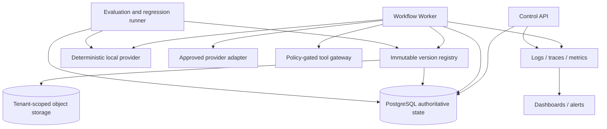

# ADR-005: AEO Foundations for Reproducible Agent Execution, Evaluation, and Operations

- **Status:** Accepted for the MVP foundation
- **Date:** 2026-08-12
- **Owner:** AEO Foundations Architecture
- **Scope:** Agent execution, engineering evidence, evaluation, and operational foundations
- **Authoritative inputs:** `../../../docs/product/SRS.md`, ADR-001 through ADR-004, `../contracts/AGENT_RUNTIME.md`, `../contracts/API_AND_DATA.md`
- **Normative companion:** `../contracts/OBSERVABILITY_AND_EVALUATION.md`

## 1. Decision

AEO Foundations is the product's shared **agent execution, engineering, evaluation, and operations foundation layer**. It is not a fifth employee, a new workflow owner, or a synonym for an ungoverned agent platform. It supplies the version registry, immutable execution manifests, causal identifiers, safe telemetry, invocation accounting, evaluation fixtures, regression gates, and replay/incident tooling used by the four governed employees and the control plane.

The foundation has five binding properties:

1. **Inputs and configuration are reproducible.** Every run and attempt records immutable references and digests for the workflow, policy, employee, instruction, prompt template, schema, rubric, tool, provider configuration, pricing, template, check set, redaction policy, application revision, container image, lockfile, and migration set that could affect the result.
2. **Causality is reconstructable.** Company, run, task, attempt, invocation, artifact, event, command correlation, immediate causation, and W3C trace/span identities remain distinct and are joined explicitly.
3. **Telemetry is not authority.** Product transitions, approvals, artifacts, budget ledgers, and ordered events remain transactional PostgreSQL records. Logs, traces, metrics, analytics, dashboards, and evaluation projections may explain or detect but may not authorize or imply success.
4. **Quality claims require criterion-level evidence.** Evaluation covers every approved acceptance criterion exactly once, distinguishes automated evidence from model judgment, treats missing required evidence as blocked, and preserves exact evidence/version lineage.
5. **Replay never fabricates certainty.** Read-only state reconstruction, offline deterministic reproduction, controlled re-evaluation, and external-side-effect reconciliation are separate operations. No operation recreates hidden reasoning, rewrites history, or blindly repeats an unknown side effect.

This decision refines the existing modular-monolith/API-worker/PostgreSQL architecture. It does not introduce a broker, workflow service, vector-memory service, telemetry database, or model gateway as an additional source of truth for the MVP.

## 2. Architectural placement



The registry is a logical module backed by PostgreSQL metadata and immutable object/code references. Registry publication is an authorized control-plane operation. Ordinary runs only resolve already-published versions. Evaluation runs use separate namespaces and cannot approve, mutate founder state, publish production artifacts, or invoke privileged tools.

## 3. Binding integration resolutions

The following resolutions close contradictions or gaps found across ADR-001 through ADR-004 and the two existing contracts. They apply until the source documents are harmonized. The SRS remains the product authority; this ADR standardizes implementation details without weakening it.

| ID       | Conflict or gap                                                                                                         | Binding resolution                                                                                                                                                                                                                                                                                                                                                  | Acceptance check                                                                                                                                                                       |
| -------- | ----------------------------------------------------------------------------------------------------------------------- | ------------------------------------------------------------------------------------------------------------------------------------------------------------------------------------------------------------------------------------------------------------------------------------------------------------------------------------------------------------------- | -------------------------------------------------------------------------------------------------------------------------------------------------------------------------------------- |
| AEO-R001 | `AGENT_RUNTIME.md` uses semantic string versions such as `"1.0"`; `API_AND_DATA.md` uses integer `schema_version: 1`.   | The registry stores `schemaFamily`, `schemaMajor`, and `schemaMinor`. Runtime contracts encode `major.minor`; existing REST v1 encodes major `1` and implies minor `0`. Boundary adapters canonicalize before hashing. A persisted manifest never stores an ambiguous unqualified `1`.                                                                              | Round-trip fixtures prove REST `1` and runtime `"1.0"` resolve to the same registry object, while unknown major/minor behavior remains contract-specific.                              |
| AEO-R002 | Workflow examples use both `prototype-run/v1` and `prototype-v1`.                                                       | The canonical MVP registry key is `workflow:prototype-run` version `1.0.0`, serialized in the current runtime field as `prototype-run/v1`. `prototype-v1` is an illustrative legacy alias only; it must not be persisted by new code. A migration/adapter may read it and emits the canonical value.                                                                | Generated OpenAPI/fixtures and new rows use `prototype-run/v1`; a compatibility fixture reads the alias without rewriting historical evidence.                                         |
| AEO-R003 | Health examples alternate between `/health/*` and `/api/v1/health/*`.                                                   | The public routes are `/api/v1/health/live` and `/api/v1/health/ready`. Headings without the prefix in `API_AND_DATA.md` are relative to its declared `/api/v1` base path.                                                                                                                                                                                          | Route test asserts only the prefixed contract unless an explicit compatibility redirect is later approved.                                                                             |
| AEO-R004 | `correlationId` is a UUID in product contracts, while OpenTelemetry `trace_id` has a different format and lifecycle.    | Business correlation UUID, immediate causation UUID, W3C `traceId`, and `spanId` are distinct fields. They must never be copied into one another. A single business operation may span multiple traces after a durable wait or retry.                                                                                                                               | Contract/log tests validate each format and show a run spanning multiple traces with intact business causality.                                                                        |
| AEO-R005 | SRS-NFR-021 says telemetry is keyed by run/task/attempt, but placing those IDs on metrics causes unbounded cardinality. | Events, structured logs, and spans carry authorized high-cardinality IDs. Metrics use bounded dimensions only (`service`, `role`, `operation`, `state`, `failureClass`, version cohort) and link sampled instances through trace exemplars or dashboard drill-down queries.                                                                                         | Metrics cardinality test rejects run/company/task/attempt/event/artifact IDs as labels.                                                                                                |
| AEO-R006 | A run pins four employee definitions, while `VersionSet` contains only one `employeeDefinitionVersionId`.               | The run manifest contains an immutable `employeeRolloutSet` mapping all four fixed employee keys to definition versions. An attempt manifest contains exactly one resolved employee definition plus the rollout-set reference.                                                                                                                                      | A rollout test proves a run retains all four definitions and every attempt resolves one member without using `latest`.                                                                 |
| AEO-R007 | Provider configuration version does not prove which mutable provider model revision actually served a request.          | Record requested provider/model/configuration and returned provider/model revision or fingerprint when available. If the provider cannot expose an immutable revision, classify the attempt as `INPUT_REPRODUCIBLE`, not bitwise reproducible, and require drift evaluation before promotion.                                                                       | Provider fixture covers exact revision, opaque alias, and changed fingerprint; dashboards split results by resolved cohort.                                                            |
| AEO-R008 | Raw prompts/completions are prohibited in telemetry and product fields, but debugging needs reproducible input.         | Persist exact registry/source references, allowed field paths, redaction version, canonical request digest, and result digest. Rendered tenant prompt/completion bodies are not logged or placed in events/analytics. An authorized tool may reconstruct allowed input from immutable sources; hidden reasoning is never required or reconstructed.                 | Seeded-content test finds no raw prompt/completion/source/attachment body in events, logs, traces, metrics, analytics, or debug bundles.                                               |
| AEO-R009 | "Replay" can mean event projection replay, model rerun, or retrying an external side effect.                            | Use four named operations: `STATE_RECONSTRUCTION`, `OFFLINE_REPRODUCTION`, `CONTROLLED_REEVALUATION`, and `SIDE_EFFECT_RECONCILIATION`. Only the last may inspect an external provider/tool outcome, and an unknown side effect is blocked rather than automatically repeated.                                                                                      | Fault fixtures prove duplicate events converge, local reproduction cannot mutate product state, and unknown tool outcome creates a recovery decision.                                  |
| AEO-R010 | Readiness descriptions disagree about when object storage/provider failure makes the process unready.                   | Readiness is role-and-capability based. PostgreSQL/schema compatibility is always required. Object storage is required only for a process with an enabled object-dependent capability. Provider and sandbox health never make the API unready; they degrade worker capability and block only dependent work.                                                        | Health matrix tests API/worker with database, object, provider, and sandbox failures independently.                                                                                    |
| AEO-R011 | ADR statuses mix `Proposed` and `Accepted` while repeated decisions already guide implementation.                       | The modular monolith, API/worker split, PostgreSQL authority, outbox, exact-version gates, default-deny tools, and sandbox/preview separation are binding foundations because they are repeated by accepted ADRs and the SRS. Environment/vendor choices, alpha numeric limits, retention, and production isolation technology remain explicit pre-alpha decisions. | Architecture conformance check maps imports, process roles, persistence, and capability flags to the binding set; unresolved configuration is visible and cannot default to unlimited. |
| AEO-R012 | Build/QA evidence types exist, but registry and evidence compatibility rules are not defined.                           | Every evidence item identifies its producer/check version, subject artifact/build digest, collection time, classification, integrity digest, and retention class. A rubric may consume only declared evidence kinds/versions; missing required evidence is `BLOCKED`.                                                                                               | Criterion fixtures reject dangling, stale, cross-build, unsupported-version, duplicate, or fabricated evidence.                                                                        |
| AEO-R013 | Runtime examples use TypeScript `bigint` for money/budgets even though JSON cannot serialize `BigInt`.                  | Application/domain code may use `bigint`. JSON contracts serialize money and potentially large quantities as canonical base-10 integer strings; PostgreSQL uses bounded `numeric`/`bigint` as appropriate. Floating-point money is forbidden.                                                                                                                       | Codec fixtures round-trip limits and micros above JavaScript's safe integer range and reject decimal fractions, exponent notation, and unsafe numeric JSON values.                     |

## 4. Version registry and execution manifests

### 4.1 Registry semantics

Every behavior-affecting definition is immutable after publication. Registry identity is the tuple:

`(kind, logicalKey, semanticVersion, contentDigest)`.

Published objects include provenance, content reference, compatibility contract, activation state, and authorization record. `ACTIVE`, `PAUSED`, and `RETIRED` control selection for new runs; they do not change historical resolvability. `REVOKED` is reserved for a security prohibition: historical reads remain possible to authorized incident tooling, but new or resumed execution fails closed according to a recorded recovery policy.

The minimum registry kinds are:

- workflow and policy;
- employee definition and employee rollout set;
- instruction bundle and prompt template;
- input, output, artifact, event, and analytics schemas;
- evaluation rubric, evaluator, and check set;
- tool definition/toolset and provider configuration;
- pricing catalog and budget policy;
- source/build template and sandbox execution policy;
- redaction/classification policy.

A prompt template is approved static behavior. A rendered prompt is tenant-derived execution input and is not itself a registry object. A schema digest is computed from canonicalized JSON Schema. A code-backed policy, validator, tool, or evaluator also references the source revision and container/package digest that executes it.

### 4.2 Manifest hierarchy

Three manifest levels prevent both omission and unnecessary duplication:

1. **Release manifest:** application revision, image digest, lockfile digest, runtime, migration set, supported contract window, and build provenance.
2. **Run manifest:** release manifest plus workflow, policy, employee rollout set, default provider configuration, pricing/budget, template, check set, redaction, and schema catalog references.
3. **Attempt manifest:** run manifest reference plus the exact resolved employee, instruction, prompt template, input/output schema, rubric, provider/model request, tools, context manifest, and deadline used by one attempt.

An Artifact Version and Evaluation record reference the attempt manifest that produced it. A final manifest references exact approved/build/QA versions and their attempt manifests. A run may intentionally change an allowed provider or recovery configuration only by creating a new manifest version and an audited targeting decision; it never mutates the prior manifest.

### 4.3 Reproducibility grades

| Grade                | Meaning                                                                                                              | Permitted claim                                                                           |
| -------------------- | -------------------------------------------------------------------------------------------------------------------- | ----------------------------------------------------------------------------------------- |
| `DETERMINISTIC`      | Local fixture provider, deterministic clock/IDs, pinned runtime/tooling, no uncontrolled external input              | Same inputs produce the expected contract output and evidence digest.                     |
| `INPUT_REPRODUCIBLE` | All inputs/configuration are reconstructable, but the external model/provider is nondeterministic or revision-opaque | The request and evaluation conditions can be reproduced; output equality is not promised. |
| `DEGRADED`           | A required version, digest, provider revision, evidence item, or source reference is missing/unreadable              | No quality or rollout claim; run/evaluation is blocked or excluded with a reason.         |

The system never labels an external generative result deterministic merely because temperature or seed was configured.

## 5. Causal observability

### 5.1 Identity model

The minimum join path is:

```text
company -> run -> task -> attempt -> model/tool/build invocation -> artifact/evidence
                    \-> ordered domain event -> outbox delivery
command correlation -> causation chain -> one or more trace/span trees
```

Rules:

- `runId` is the durable workflow identity.
- `correlationId` groups one founder command or async business chain.
- `causationId` points to the immediate command, event, attempt, or invocation that caused a record.
- `traceId` and `spanId` describe one live execution path and may change across a durable wait/retry.
- `attemptId` changes on retry; a provider/tool logical idempotency key may remain stable where safe.
- `eventId` and `(runId, runSequence)` identify the authoritative audit event, never a log line.

### 5.2 Signal responsibilities

| Signal                     | Purpose                                                              | Authority                                                               | Retention/access                                     |
| -------------------------- | -------------------------------------------------------------------- | ----------------------------------------------------------------------- | ---------------------------------------------------- |
| Ordered domain event       | Founder/audit-visible material fact and causal history               | Authoritative when committed with state                                 | Product/security policy; audience projected          |
| Operational log            | Bounded diagnostic fact about one execution step                     | Non-authoritative                                                       | Shorter, role-restricted, redacted                   |
| Trace/span                 | Timing and dependency path                                           | Non-authoritative                                                       | Sampled, redacted, operations access                 |
| Metric                     | Aggregate rate, latency, saturation, cost, error, or security signal | Non-authoritative                                                       | Low-cardinality aggregate                            |
| Analytics event/projection | Product/governance/quality measure                                   | Derived and rebuildable                                                 | Classified by audience; deduplicated by event ID     |
| Evidence object            | Check result supporting a criterion or incident                      | Authoritative only as referenced by a committed evaluation/audit record | Immutable checksum, bounded content, retention class |

Telemetry emission failure must not roll back already-authoritative state. Conversely, a log or successful span must never compensate for a missing domain event/outbox record.

### 5.3 Minimum operational coverage

API, worker, publisher, provider, tool, object, build, evaluation, and migration paths emit structured signals using the companion contract. Metrics cover:

- API request count/latency/error and readiness;
- database pool use, transaction latency/retry/deadlock;
- eligible work/claim latency, queue age, lease expiry/reclaim, retry and cancellation;
- outbox oldest age, publish attempts, dead letters, sequence gaps, consumer lag;
- model success/error/timeout/schema repair, tokens, attributable cost, latency, provider/model/config cohort;
- tool/build success, duration, output/log limits, security/policy denial;
- budget reservation/consumption/reconciliation/exhaustion;
- criterion pass/fail/blocked/not-applicable, missing evidence, findings, rework cycles, regression gate outcome;
- redaction failures, cross-tenant denials, sandbox signals, kill/rollback actions.

## 6. Model, tool, build, and budget accounting

Accounting is append-only and reconciliation-aware:

1. A claim atomically creates budget reservations before external work.
2. Each invocation records requested limits, observed usage, usage source, unit, provider/tool revision, pricing-catalog version, currency, amount in integer micros, and whether cost is `PROVIDER_REPORTED`, `CATALOG_COMPUTED`, or `ESTIMATED`.
3. Completion consumes or releases each reservation idempotently. Partial/unknown outcomes remain reserved only for a bounded reconciliation window, after which policy moves the run to a safe blocked state.
4. Aggregates are projections from immutable accounting entries and must reconcile to the Budget Ledger.
5. Cost dashboards group by workflow, provider/model, employee, prompt/instruction, template, rubric/check set, and release manifest. Customer content is never an accounting dimension.

Provider invoices may disagree with per-request estimates. A separately versioned reconciliation job records variance; it does not rewrite the original usage record. Tool/build computation records wall time and metered compute separately so queue wait is not misreported as compute.

## 7. Evaluation foundation and drift gates

### 7.1 Evaluation fixture

An evaluation fixture is immutable, non-sensitive, and versioned. It includes:

- structured goal/company/context input references and expected qualification class;
- boundary properties such as maximum flow/screen behavior and explicit out-of-scope expectations;
- expected artifact schemas and stable criterion IDs;
- required automated/model/manual evidence kinds;
- allowed qualitative ranges rather than a single model-authored answer;
- deterministic local-provider scenario scripts for success and classified failures;
- permitted model/tool/time/cost envelope;
- fixture owner, review date, provenance, and content digest.

The 10-goal release suite is a named immutable `EvalSuiteVersion`. A change to a fixture or expectation creates a new version and an approval record; it cannot erase a prior regression.

### 7.2 Criterion evidence

Every verdict references evidence about the exact candidate build or artifact. Evidence records include subject digest, producer/check version, environment manifest, timestamps, integrity digest, classification, and result. Model assessment must be labeled as model judgment. Automated evidence must identify the command/check/assertion and exit/result. Founder observation must identify the founder-authored decision record without turning it into an automated pass.

The evaluator enforces:

- one verdict for every approved acceptance criterion;
- no unknown or duplicate criterion;
- required evidence present and readable;
- evidence belongs to the candidate's exact run/build/version set;
- a blocking finding cannot coexist with a passing current verdict for the same unresolved condition;
- `FINAL_READY` is impossible with missing required evidence or unresolved blocking findings;
- cycle three is impossible.

### 7.3 Change and drift gates

Every proposed release or target change declares which registry objects changed. The gate selects required tests from that change set:

| Change                                               | Minimum required gate                                                                                                 |
| ---------------------------------------------------- | --------------------------------------------------------------------------------------------------------------------- |
| Schema, envelope, policy, workflow, state transition | Contract compatibility, transition/property suite, duplicate/restart/cancel fault suite                               |
| Employee, instruction, prompt, model/provider        | Deterministic runtime suite, malformed/timeout/safety fixtures, affected goal fixtures, quality/cost drift comparison |
| Rubric, evaluator, check set                         | Criterion coverage/evidence consistency suite and re-score of the immutable baseline candidates                       |
| Tool, sandbox policy, template, dependency lock      | Build/security/egress/secret checks, affected-plus-regression build suite                                             |
| Redaction, event, analytics                          | Seeded-secret/content tests, schema/dedup/reconciliation tests, dashboard fixture                                     |
| Release image, database migration                    | Build, migration compatibility, historical run read/resume, rollback and Compose smoke                                |

Non-waivable gate conditions are zero tenant/approval/policy/sandbox/secret violations, 100% required criterion coverage, no fabricated pass when evidence is missing, and no unreadable historical lineage. Before private alpha, the candidate must also meet SRS AT-001 through AT-015, at least 8 of 10 approved goal fixtures yielding runnable previews, and three consecutive golden runs with no privileged repair.

Drift is evaluated across the exact baseline and candidate version manifests. Static drift detects runtime versions that differ from the targeted manifest. Contract drift detects schema or semantic incompatibility. Behavioral drift compares qualification, structured-output repair, build, criterion, finding, rework, latency, and cost distributions. The versioned drift policy owns numeric thresholds; no release may use an undefined or unlimited threshold. Updating the baseline requires recorded Product, Engineering, and QA approval and retains the failed comparison.

## 8. Replay, debugging, and incident workflow

### 8.1 Supported operations

| Operation                    | Input                                                                                       | External side effects                                                  | Output                                                                        |
| ---------------------------- | ------------------------------------------------------------------------------------------- | ---------------------------------------------------------------------- | ----------------------------------------------------------------------------- |
| `STATE_RECONSTRUCTION`       | Transactional state, immutable objects, ordered events                                      | None                                                                   | Read-only timeline, current legal state, lineage and missing-reference report |
| `OFFLINE_REPRODUCTION`       | Attempt manifest plus immutable allowed sources and deterministic local provider            | None; tools are simulated                                              | Contract output/evidence diff against recorded attempt                        |
| `CONTROLLED_REEVALUATION`    | Existing immutable candidate plus a new evaluator/rubric/provider manifest                  | No founder/product mutation; no privileged tool                        | New evaluation-run record linked to the candidate and baseline                |
| `SIDE_EFFECT_RECONCILIATION` | Invocation record, idempotency key, provider/tool lookup capability, operator authorization | Lookup/cancel only unless a policy explicitly authorizes a new attempt | Classified observed outcome or `UNKNOWN_OUTCOME` and recovery decision        |

A debug bundle contains IDs, state/event summaries, version manifests, digests, failure classes, bounded safe evidence, and redaction results. It excludes raw prompts/completions, source/attachment bodies, credentials, signed URLs, arbitrary stack payloads, foreign tenant data, and hidden reasoning.

### 8.2 Incident sequence

1. Detect from an alert, security signal, founder report, or regression gate.
2. Correlate the run/task/attempt/invocation and preserve immutable evidence.
3. Pause the affected target/version or issue the separately authorized kill; never approve or edit an artifact.
4. Reconstruct authoritative state and classify whether the failure is data, policy, code, provider, tool, sandbox, or telemetry.
5. Reproduce offline where possible; otherwise perform controlled re-evaluation or side-effect reconciliation.
6. Roll back target selection for new work, or deploy a compatible fix. Historical manifests remain unchanged.
7. Verify recovery, event/budget reconciliation, and alert clearance before resuming.
8. Record detection/recovery times, owner, affected versions, root cause, corrective gate, and communication. No hidden reasoning is required.

## 9. Privacy, redaction, and evidence handling

The foundation applies classification at creation and redaction before serialization/export. Minimum classes are `PUBLIC`, `INTERNAL`, `TENANT_CONTENT`, `SECURITY_RESTRICTED`, and `SECRET`. `SECRET` values are accepted only through the secret/configuration boundary and are never valid event, artifact, analytics, log, trace, metric, evaluation-fixture, or debug-bundle fields.

Controls apply at three points:

1. **Source allowlist:** DTO/envelope schemas omit prohibited fields and require exact permitted references.
2. **Serializer guard:** key/value patterns, content class, maximum lengths, URLs, stack/provider payloads, and free-form fields are redacted or rejected before emission.
3. **Sink guard:** telemetry/evidence exporters enforce audience, retention, and size again; a failed redaction closes or drops the diagnostic signal and emits a safe counter, never the original payload.

Tenant content may live in authorized artifacts/object storage but does not enter general telemetry. Operations and security views receive safe metadata. Founder views receive product conclusions and evidence references. Cross-audience rendering produces separate projections; an internal payload is never sent and merely hidden by the client.

## 10. Developer ergonomics and deterministic local execution

The local foundation must work without paid or external provider calls:

- `DeterministicModelProvider` selects an immutable scenario by fixture/task key and returns schema-valid success, malformed output, timeout, rate-limit, cancellation, safety block, or unknown-outcome responses with fixed usage/cost metadata.
- Tests inject deterministic clock, UUID generator, retry jitter, provider, object store, publisher, and tool/sandbox adapters.
- The fixture provider verifies its request digest and expected version manifest before returning a response; accidental prompt/schema/context drift fails loudly.
- A single foreground verification command performs format/lint/type/build, contract fixtures, unit tests, migration checks, PostgreSQL integration, container build, and Compose smoke without a background process left running.
- Optional local OpenTelemetry collection is a profile. Core tests assert emitted signal contracts in memory and do not require a telemetry server.
- Developers can print a safe manifest/diff and correlation map for a fixture, never raw tenant content or secrets.

## 11. Readiness levels

Readiness is cumulative. A later level cannot waive an earlier control.

| Level                     | Capability                                                                                                                                       | Required evidence                                                                                                                | Primary trace                                                         |
| ------------------------- | ------------------------------------------------------------------------------------------------------------------------------------------------ | -------------------------------------------------------------------------------------------------------------------------------- | --------------------------------------------------------------------- |
| `AEO-L0 SKELETON`         | Registry types, release/run/attempt manifests, causal context, redaction library, in-memory signal exporters, deterministic provider             | Contract round trips; version/digest validation; prohibited-field tests; local success/failure fixtures                          | AICO-005, AICO-009, AICO-022; SRS-NFR-020–021, 025                  |
| `AEO-L1 FOUNDATION`       | API/worker structured signals, health/readiness matrix, domain-event/outbox correlation, budget/accounting entries, safe debug bundle            | First vertical-slice integration; duplicate/outbox fault test; metric-cardinality test; config/secret seed test                  | AICO-010, AICO-025, AICO-033; SRS-FR-038–043, 074–076             |
| `AEO-L2 GOVERNED_RUNTIME` | Published employee/instruction/schema/rubric/provider/tool registries, attempt manifests, policy-before-tools, local/external adapter accounting | Malformed/timeout/cancel/policy/budget matrix; context isolation; rollout/rollback version pinning                               | AICO-030–033, AICO-079; SRS-FR-084–095                            |
| `AEO-L3 QUALITY_SYSTEM`   | Evidence registry, criterion evaluation, immutable fixture suites, regression/drift gates, quality/cost dashboards and alerts                    | Complete criterion fixtures; affected-plus-regression tests; analytics reconciliation; alert simulation                          | AICO-056, AICO-059–064, AICO-072–077; SRS-FR-061–069, 093–096 |
| `AEO-L4 PRIVATE_ALPHA`    | Incident/replay/restore/rollback operations and release evidence matrix                                                                          | AT-001–015; restart/duplicate/cancel/budget chaos; 10 goals with >=8 previews; three golden runs; restore/kill/rollback drills | AICO-084–091; SRS section 12 and DoD section 15                     |

## 12. Implementation work packages

1. **Contracts and adapters:** implement the companion contract types/schemas, version normalization, canonical hashing, and compatibility fixtures.
2. **Registry and manifests:** add immutable registry metadata, publication/targeting controls, release/run/attempt manifests, and rollout-set resolver.
3. **Causal telemetry:** add request/worker context propagation, JSON logger, OpenTelemetry adapters, bounded metrics, redaction, and health matrix.
4. **Invocation accounting:** add reservations/usage/reconciliation records and provider/tool/build instrumentation.
5. **Deterministic provider:** implement scenario fixtures and failure injection as the default local/test adapter.
6. **Evidence/evaluation:** add evidence records, fixture/suite versions, evaluation-run isolation, criterion validators, and regression comparison.
7. **Operations:** add safe debug bundles, state reconstruction, drift dashboards, alert rules, incident/rollback runbooks, and release evidence export.

Each package must land behind strict schemas and tests. Instrumentation that exposes unredacted data or creates unbounded metric cardinality is a release blocker, not a follow-up cleanup.

## 13. Acceptance checks

1. A run can be explained from a release/run/attempt manifest without consulting mutable `latest` configuration.
2. Replaying the same deterministic fixture produces the expected contract/evidence digest; an external-provider attempt is correctly labeled `INPUT_REPRODUCIBLE`.
3. A command can cross API commit, outbox delivery, durable wait, worker restart, retry, model/tool invocation, artifact creation, and evaluation while preserving business causality across multiple traces.
4. Metrics expose no tenant or run/task/attempt identifiers as labels; logs/traces/events remain tenant- and audience-safe.
5. Model/tool/build usage entries reconcile with reservations and ledger totals under success, timeout, cancel, duplicate, and unknown-outcome paths.
6. A changed instruction, prompt, schema, rubric, model configuration, tool, template, or release digest selects and executes the required regression gate.
7. QA publication fails on missing/duplicate criteria, stale/cross-build evidence, unsupported evidence versions, contradictory findings, or a fabricated pass.
8. State reconstruction and offline reproduction make no product mutation; controlled re-evaluation creates new lineage; unknown external side effects are not replayed.
9. Seeded credentials, prompt/completion text, source/attachment bodies, signed URLs, hidden reasoning, and foreign tenant IDs are absent from every signal and debug bundle.
10. Alert simulations identify the responsible run/version cohort and link a safe runbook without requiring database mutation.
11. The readiness level is queryable from passing evidence, not a manually set environment flag.
12. Every check maps to an SRS requirement and AICO issue in the companion contract and the release evidence matrix.

## 14. Consequences

### Benefits

- Version and evidence lineage becomes a first-class engineering control instead of scattered log metadata.
- The team can diagnose and compare agent behavior without storing hidden reasoning or leaking tenant content.
- Deterministic local execution keeps development and CI independent of paid, flaky providers.
- Quality, cost, reliability, and governance changes can be gated against the exact version set they affect.
- Incident response can pause/rollback versions and reconcile side effects without rewriting founder decisions or historical runs.

### Costs and obligations

- Every behavior-affecting component needs publication, digest, compatibility, and retirement discipline.
- Telemetry schemas and cardinality require review just like API/event schemas.
- External model outputs remain nondeterministic; the product must communicate reproducible inputs/evidence rather than promise identical generations.
- Evaluation fixtures and baselines are product assets with owners and review cycles, not disposable test data.
- Accounting and incident evidence require reconciliation jobs and retention/access policies before external alpha.
