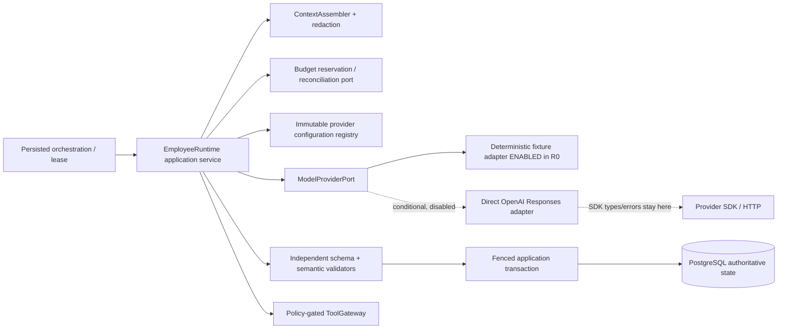

# ADR-011: Model Provider and Employee Runtime Boundary Selection

**Status:** Proposed for AICO-005 owner acceptance
**Date:** 2026-08-15
**Architecture/AI evidence:** Pending
**Product + Legal/Security evidence:** Pending
**Parent:** `duckvhuynh/aicompanyos#5`
**Historical decision child:** `duckvhuynh/aico-backend#25`, completed
**Historical proof child:** `duckvhuynh/aico-backend#26`, completed
**Governing change child:** `duckvhuynh/aico-backend#31`
**Decision scope:** AICO-005 only
**Product trace SHA:** `28d2bc0ecd9e5676a4e87f1bf5e81c602a1a0714`
**Product trace:** Goals G-03 and G-04; SRS TD-005; PRD-FR-058, PRD-FR-061,
PRD-FR-063; SRS-FR-084, SRS-FR-089–091; SRS-NFR-020, SRS-NFR-025,
SRS-NFR-027; DEP-01
**Foundation trace:** ADR-002, ADR-005, `docs/contracts/AGENT_RUNTIME.md`

No owner decision, exact semantic SHA, hosted acceptance result, external account, or model is
accepted by this Proposed document. The permanent evidence fields remain Pending until attributable
owners review the same clean semantic revision.

## 1. Context and decision pressure

ADR-002 already fixes the product topology: the PostgreSQL-backed worker invokes one governed
`EmployeeRuntime`, which depends inward on a provider-neutral `ModelProviderPort`. ADR-005 requires
immutable execution manifests, explicit causal identities, attributable cost, redacted evidence,
and honest reproducibility grades. The normative Agent Runtime contract establishes the first
request/result vocabulary. AICO-005 must refine that seam without implementing the production
runtime or allowing a provider SDK to become domain authority.

The product needs typed employee outputs, cancellation, hard deadlines, independent validation,
bounded repair, failure classification, exact configuration lineage, safe rollout/rollback, and
usage/cost evidence. The provider and content-use decision is also an external dependency: terms,
account controls, data location, retention, model availability, rate limits, and price can change
outside this repository. Choosing an exact external model before account and evaluation evidence
exists would turn an architecture decision into an unsupported production activation.

The governing constraints are:

1. Employee roles, context, outputs, and authoritative transitions are domain concerns.
2. Provider request/response formats, SDK errors, headers, and model aliases are adapter concerns.
3. Model output is untrusted candidate data until independent runtime validation and a fenced
   application transaction accept it.
4. A retry, repair, fallback, or late response cannot create hidden work or bypass budget,
   cancellation, lease, policy, or version controls.
5. R0 verification must be deterministic, foreground, paid-service-free, credential-free, and
   safe for hosted CI.

## 2. Decision

Use the existing modular-monolith Employee Runtime boundary with a closed provider-neutral port.
For R0, `DETERMINISTIC_FIXTURE` is the only enabled provider. It exists only in local/test/CI
environments, produces closed deterministic outcomes, and must fail configuration validation if it
is selected in a deployed production environment.

Record `OPENAI_RESPONSES_DIRECT` as the single `CONDITIONAL_DISABLED` external candidate. This is a
directional adapter choice, not an exact provider/model/configuration activation. No external call
is permitted until a later exact manifest receives attributable Product + Legal/Security acceptance
and Architecture/AI confirmation after account-control and representative evaluation evidence.

Contract v1 uses exact provider/adapter pairs `DETERMINISTIC_FIXTURE` / `DETERMINISTIC_FIXTURE` and
`OPENAI_RESPONSES_DIRECT` / `DIRECT_PROVIDER`. Anthropic, Gemini, and aggregator/router names in the
comparison are options, not valid v1 configuration or invocation keys. The v1 invocation and applied-
target envelopes structurally admit only the deterministic pair in `LOCAL`, `TEST`, or `CI`.
`OPENAI_RESPONSES_DIRECT` may exist only as a non-invocable `DISABLED` or `PENDING_MANIFEST`
configuration with no allowed environments; making it callable requires a later accepted manifest
and contract/schema revision.

The following strings are binding fail-closed requirements:

- training use prohibited; no opt-in training or consent surface in MVP
- no automatic cross-provider fallback
- provider SDK retries are disabled
- no worker sleeps
- post-dispatch timeout is UNKNOWN
- repair cap is 1
- separate invocation and reservation
- raw prompts and hidden reasoning are prohibited
- rollback and kill never rewrite historical lineage

The runtime, not an SDK or provider, owns dispatch identity, persisted retry scheduling, deadline and
cancel propagation, validation, repair eligibility, tool authorization, accounting reconciliation,
target selection, and commit fencing.

## 3. Options and trade-offs

Provider evidence was reviewed from first-party sources on 2026-08-15. Terms, prices, supported
models, and eligibility are operational inputs, not immutable architectural facts; the activation
gate must re-check them.

| Option                        | Current first-party evidence                                                                                                                                                                                                                                                                                                   | Advantages                                                                                                                                                          | Costs and risks                                                                                                                                                                                                                                            | R0 disposition and evolution trigger                                                                                                                                                                                                                                                                       |
| ----------------------------- | ------------------------------------------------------------------------------------------------------------------------------------------------------------------------------------------------------------------------------------------------------------------------------------------------------------------------------ | ------------------------------------------------------------------------------------------------------------------------------------------------------------------- | ---------------------------------------------------------------------------------------------------------------------------------------------------------------------------------------------------------------------------------------------------------- | ---------------------------------------------------------------------------------------------------------------------------------------------------------------------------------------------------------------------------------------------------------------------------------------------------------- |
| Deterministic local fixture   | Repository-owned closed fixtures need no network, account, credential, retention exception, or paid quota.                                                                                                                                                                                                                     | Exact outcomes, clocks, identifiers, usage/cost receipts, timeouts, cancellation, refusal/redaction, malformed output, and rate-limit cases are reproducible in CI. | It does not demonstrate external quality, latency, service behavior, provider terms, or production capacity.                                                                                                                                               | **Selected and enabled only for R0.** Replace as the only production target only after an external activation manifest is accepted. Production configuration selecting it is invalid.                                                                                                                      |
| Direct OpenAI Responses API   | OpenAI documents Responses structured JSON-schema output, per-response statuses and usage, model snapshots for supported models, and API data controls. API data is not used for training by default; default abuse-monitoring retention and Responses application-state behavior still require exact account/endpoint review. | One direct contractual/data path; mature TypeScript adapter; structured output and request IDs fit the port; model snapshots can improve lineage where available.   | Account/ZDR eligibility, `store` behavior, model snapshot, region, price, limits, safety behavior, and SDK retry defaults must be pinned. External output remains nondeterministic and independently validated.                                            | **`CONDITIONAL_DISABLED` candidate.** A successor decision/schema may enable it only after the exact manifest, account evidence, bounded spend, disclosure, and representative evaluations are accepted. Reconsider if required data controls, region, schema, snapshot, quality, or cost are unavailable. |
| Direct Anthropic Messages API | Anthropic documents schema-constrained outputs and strict tool inputs. Its commercial API retention page states inputs/outputs are normally deleted within 30 days, subject to documented exceptions or a separate ZDR agreement.                                                                                              | Direct vendor relationship; strong structured-output capability; provider-neutral port can support a later adapter without domain changes.                          | Separate API semantics, SDK/error normalization, retention/account evidence, covered-model rules, model/version availability, and evaluation remain unresolved. Adding two direct adapters now doubles proof and operational surface.                      | **Not selected for MVP activation.** Keep as a substitution candidate if OpenAI activation fails a required control or evaluation and a separately accepted Anthropic manifest passes the same gates.                                                                                                      |
| Paid Gemini Developer API     | Google documents JSON-schema structured output. Paid Services do not use prompts/responses to improve products, while abuse-monitoring, feature-specific storage, billing, project controls, and ZDR eligibility still require exact configuration review.                                                                     | Direct vendor, structured output, project/billing controls, and a credible future adapter boundary.                                                                 | Google-specific API/error/safety semantics, project/account configuration, logging/storage features, regions, quotas, exact model, and evaluation are unresolved.                                                                                          | **Not selected for MVP activation.** Reconsider if the conditional candidate is rejected and a paid-project exact manifest satisfies data, region, structure, cost, and evaluation gates. Free/unpaid data terms are not eligible for founder content.                                                     |
| Aggregator/router             | OpenRouter documents multi-provider routing, default load balancing, fallbacks, provider/data-policy filtering, and an additional billing/privacy layer.                                                                                                                                                                       | One API can reach multiple vendors and optimize availability or price.                                                                                              | Adds another processor, policy surface, billing lineage, provider-resolution ambiguity, and failure domain. Default routing/fallback behavior conflicts with exact targeting and the ban on silent failover. Each downstream provider's terms still apply. | **Rejected for MVP.** Reconsider only when multiple accepted direct providers are operationally necessary and the router can hard-pin one model/provider/region/data policy with fallbacks off, expose complete lineage/cost, and pass a separately accepted threat/evaluation package.                    |

### 3.1 Why the conditional candidate is direct OpenAI Responses

Direct OpenAI is the smallest credible external adapter hypothesis because the Responses API exposes
structured output, request identity, status, usage, and direct data-control documentation without an
intermediary router. That reduces processors and resolution ambiguity. It does not establish model
quality, legal suitability, regional availability, cost fitness, or production readiness.

No exact model is named because the representative AICO-086 evaluation fixtures, approved alpha
budgets, account access, and final terms/settings evidence do not exist yet. Mutable aliases are not
acceptable activation targets. The later manifest must name an exact model identifier or snapshot
and must record any returned revision/fingerprint. If the provider cannot expose immutable served
revision, ADR-005's `INPUT_REPRODUCIBLE` grade applies; the attempt can never be called
deterministic.

There is no aggregator/router in the selected MVP path. Adding one would require a superseding
decision because it changes processor, resolution, fallback, accounting, and failure boundaries.

### 3.2 Rejection and substitution rules

The conditional candidate is rejected or paused when any required account/data control cannot be
verified, a required schema or abort/deadline behavior is unavailable, resolved-model drift cannot
be detected, the bounded evaluation misses its accepted threshold, cost/latency exceeds the accepted
manifest, or a critical provider/security incident activates the kill policy.

Substitution never happens inside a running invocation. A different provider requires a separately
published immutable provider configuration and rollout decision. Eligible new attempts may target
that accepted configuration; existing and historical attempts retain their original lineage.

## 4. Architecture and dependency direction



Dependency rules:

- Domain and application modules define employee execution, context, validation, failure, budget,
  and output semantics. They import no provider SDK, HTTP transport, or vendor error type.
- The provider port accepts a least-privilege call DTO. It does not accept an ORM entity, arbitrary
  task transcript, credential, mutable `latest` reference, or caller-selected provider alias.
- Each adapter converts the neutral DTO to one provider request and normalizes the provider response
  or transport error into one closed result. SDK objects never cross the adapter boundary.
- Credentials are resolved inside the adapter from environment/workload identity. They are never
  fields in a domain request, manifest, event, log, or evidence bundle.
- Tool proposals are data. Only `ToolGateway` may authorize and execute a declared request after a
  fresh parameter-bound policy decision; a provider adapter cannot execute a tool.
- PostgreSQL attempt/invocation/budget records remain authoritative. Provider state, telemetry, and
  SDK retry state are not workflow truth.

## 5. Contract separation

### 5.1 Domain execution input

`EmployeeExecutionRequest` remains application/domain language. It identifies company, run, task,
attempt, employee definition, exact input/context manifest, objective, expected employee output,
policy/budget references, lease token, and deadline. It is not serialized directly to any provider.

`ContextAssembler` resolves only allowlisted exact references, applies the pinned redaction policy,
canonicalizes the allowed content, enforces byte/token bounds, and records a digest. Cross-company
content, mutable aliases, arbitrary transcripts, credentials, private infrastructure details, raw
provider exchanges, and hidden reasoning are excluded before the provider DTO exists.

### 5.2 Least-privilege provider call DTO

The provider-neutral call has this semantic shape; the normative companion contract owns exact
wire-schema details:

```ts
interface ProviderInvocationRequest {
  contract: 'aico.model-provider-invocation-request';
  schema_version: '1.0';
  company_id: UUID;
  run_id: UUID;
  task_id: UUID;
  attempt_id: UUID;
  invocation_id: UUID;
  logical_idempotency_key: string;
  correlation_id: UUID;
  causation_id: UUID;
  invocation_kind: 'PRIMARY' | 'SCHEMA_REPAIR';
  repairs_invocation_id?: UUID;
  provider_configuration: {
    id: UUID;
    version: string;
    digest: Sha256;
    provider_key: 'DETERMINISTIC_FIXTURE';
    adapter_kind: 'DETERMINISTIC_FIXTURE';
    execution_mode: 'DETERMINISTIC_ONLY';
    requested_model: string;
  };
  content: SafeContentPart[];
  output_schema: { id: UUID; version: string; digest: Sha256; json_schema: object };
  declared_tools: DeclaredTool[];
  limits: {
    maximum_input_tokens: number;
    maximum_output_tokens: number;
    maximum_cost_micros: DecimalIntegerString;
    currency: string;
  };
  deadline_at: Rfc3339Utc;
  request_digest: Sha256;
  redaction_policy: { version: string; digest: Sha256 };
}
```

Opaque company/run/task/attempt and causal identities let the trusted runtime validate and join the
neutral DTO, but adapters must not automatically forward them as provider-visible metadata.
Provider-visible data must not expose company names, founder identity, internal authorization,
lease tokens, secrets, or storage paths. `logical_idempotency_key` is stable only for reconciliation
of the same logical invocation. It is not permission to replay an unknown post-dispatch outcome.

Every typed version-reference position also enforces its exact kind. A syntactically valid ID/
version/digest for a policy cannot satisfy a workflow, employee-definition, schema, toolset,
provider-configuration, pricing-catalog, budget-policy, safety-policy, or redaction-policy slot.
Wrong-kind references fail before dispatch; a generic structurally similar reference is not
substitutable.

### 5.3 Closed provider result

`ModelProviderPort.invoke(request, signal)` returns exactly one provider-neutral result with status
`SUCCEEDED`, `FAILED`, `CANCELED`, or `UNKNOWN`. A normalized result records:

- invocation, attempt, request digest, provider configuration ID/version/digest, provider request ID,
  requested model, returned/resolved model or revision/fingerprint when supplied;
- candidate output and proposed tool requests only on a structurally eligible success; neither has
  execution, artifact, task, approval, or state-transition authority;
- input, output, cached, reasoning, and total token usage when exposed, using bounded non-negative
  decimal-string quantities or `null` with explicit `REPORTED`/`ESTIMATED`/`UNAVAILABLE`
  provenance;
- cost amount as canonical integer micros and ISO currency when known, or `null` when unavailable,
  with pricing-catalog version and `REPORTED`/`ESTIMATED`/`UNAVAILABLE` provenance;
- monotonic latency, finish reason, refusal/safety outcome, redaction policy/result, and response
  digest without raw provider content;
- on failure, one closed failure class, bounded reason code/safe message, dispatch certainty,
  retry guidance, and a sanitized provider code/header allowlist.

Invalid field combinations fail result parsing. `SUCCEEDED` requires candidate output, independent
validation `PASSED`, complete configuration/schema lineage, a safe `PASS` or policy-accepted
`REDACTED` outcome, `REPORTED` and accepted provider/model resolution, and no
`UNACCEPTED_DRIFT`. `DROPPED`, `BLOCKED`, `UNKNOWN` safety, unavailable/unaccepted model resolution,
or integrity uncertainty cannot be reported as success. `FAILED` requires a classified failure.
`CANCELED` cannot carry a committable candidate. `UNKNOWN` cannot be treated as success or
automatically replayed.

## 6. Independent validation and one bounded repair

Provider-native structured output is defense in depth, not product authority. The runtime validates
the candidate against the exact pinned strict schema, rejects unknown fields/enums, and then runs
employee/output-specific semantic and lineage validators. It also rechecks size, tool declarations,
tenant/reference ownership, limits, safety state, lease, cancellation, and current attempt authority.

Before all validation passes, candidate output and tool proposals have zero authority: no artifact,
task success, tool call, event claiming success, approval, downstream dispatch, or authoritative
state mutation is allowed. Even a valid candidate becomes authoritative only in a transaction that
rechecks the active lease token, non-terminal run/task state, policy, budget, and exact lineage.

For R0, repair cap is 1. A repair is a `SCHEMA_REPAIR` with a separate invocation and reservation.
It receives the original allowlisted/redacted context plus bounded safe validator diagnostics such as
JSON pointers and reason codes. It does not receive raw invalid output, provider error bodies,
secrets, hidden reasoning, or new authority. The repair request references the failed invocation,
uses the same exact schema/configuration unless a separately accepted policy says otherwise, and has
its own identity, deadline, usage, cost, result, and reconciliation. A second invalid candidate
becomes `VALIDATION` failure and blocks/fails according to the pinned runtime policy.

Separation is a cross-field semantic invariant, not a boolean assertion: the repair invocation ID
must differ from the failed invocation ID, and the original and repair reservation-ID sets must be
disjoint. The runtime validator must reject identity or reservation reuse. Child #26 must prove both
rejections; schema shape alone is not evidence that the values are distinct.

## 7. Failure, cancellation, timeout, and retry semantics

Dispatch certainty is recorded as `NOT_DISPATCHED`, `DISPATCHED`, or `UNCERTAIN`. Transport wording
alone cannot establish that a provider did not receive a request.

| Condition                                                                                 | Normalized result                                                                                        | Runtime action                                                                                                |
| ----------------------------------------------------------------------------------------- | -------------------------------------------------------------------------------------------------------- | ------------------------------------------------------------------------------------------------------------- |
| Configuration, policy, schema, content, or budget denial before adapter dispatch          | `FAILED` with `CONFIGURATION`, `POLICY_DENIED`, `VALIDATION`, or `BUDGET_EXHAUSTED` and `NOT_DISPATCHED` | No provider call and no retry until authoritative input changes.                                              |
| Connection/setup failure proven before bytes can be accepted                              | `FAILED` with `PRE_DISPATCH_TRANSIENT` and `NOT_DISPATCHED`                                              | Runtime may persist one eligible retry schedule under the pinned retry budget.                                |
| HTTP/provider rate limit with a valid bounded retry hint                                  | `FAILED` with `RATE_LIMITED` and recorded dispatch certainty                                             | Persist `nextAttemptAt` after validating/clamping the hint; reserve again on the later attempt.               |
| Provider refusal or safety block                                                          | `FAILED` with `REFUSAL_SAFETY`                                                                           | No schema repair and no automatic provider substitution; expose only a safe reason.                           |
| Strict/semantic output validation failure                                                 | `FAILED` with `VALIDATION`                                                                               | Permit the one separate repair only when policy and budget allow; otherwise block/fail.                       |
| Abort observed before dispatch                                                            | `CANCELED` with failure class `CANCELED` and `NOT_DISPATCHED`                                            | No retry and no result authority.                                                                             |
| Abort after dispatch, lease loss, or terminal run                                         | `CANCELED` with failure class `CANCELED` locally; provider completion may still arrive                   | Persist cancellation/reconciliation facts; every late result is fenced from commit.                           |
| Deadline/connection loss after dispatch or dispatch certainty cannot be proved            | `UNKNOWN` with `POST_DISPATCH_TIMEOUT_UNKNOWN`                                                           | Block for reconciliation; never infer failure or auto-replay. Specifically, post-dispatch timeout is UNKNOWN. |
| Provider 4xx contract/auth error, unsupported model/schema, or terminal provider response | `FAILED` with `TERMINAL_PROVIDER` or `CONFIGURATION`                                                     | Pause/kill the target when indicated; no retry without corrected accepted configuration.                      |
| Unclassified or malformed adapter result                                                  | `UNKNOWN` with `INTEGRITY`                                                                               | Fail closed, quarantine bounded diagnostics, and alert; never fabricate a known result.                       |

Provider SDK retries are disabled (`maxRetries: 0`, or the equivalent) so each network attempt maps
to one persisted invocation. There are no adapter retries, provider fallbacks, or retrying tool loops.
The OpenAI and Anthropic TypeScript SDKs currently document automatic retries by default, which is
why adapter construction must override them.

No worker sleeps. Backoff is persisted as `nextAttemptAt` with attempt/failure/policy/version
lineage. A future worker claims eligible work and repeats every current-state, kill, cancellation,
lease, policy, and budget check. Retry count, repair count, and cost are separate bounded budget
categories. Retry uses a new attempt/invocation record; a stable logical key is retained only where
safe for provider reconciliation.

There is no silent fallback inside an invocation or retry. In particular, no automatic
cross-provider fallback. A rate limit, refusal, outage, or cost threshold cannot silently choose a
different model or provider configuration.

## 8. Accounting, evidence, and redaction

Authoritative accounting is the invocation record plus AICO-033's atomic budget ledger. Before each
primary, repair, or retry dispatch, the runtime reserves maximum tokens/cost under the exact pricing
catalog/configuration. Completion reconciles reported usage and cost idempotently. Missing or
ambiguous usage or cost is explicitly `UNAVAILABLE` and cannot be rounded to zero. `ESTIMATED` is
used only when a bounded attributed estimator actually produced a value. An unknown outcome keeps
its reservation until reconciliation or an authorized recovery decision.

Redaction outcome is closed to `PASS`, `REDACTED`, or `DROPPED`. `DROPPED` means prohibited content
was omitted rather than retained under a placeholder; it is never silently promoted to `PASS` and
cannot support a `SUCCEEDED` result when required candidate content was dropped.

Bounded evidence may contain only opaque causal IDs, exact version/digest references, status/failure
class, safe reason code, provider request ID after allowlist validation, requested/resolved model
identifiers, counts, integer-micro cost/currency/provenance, latency, finish/safety/redaction outcome,
retry/repair counters, and integrity digests. High-cardinality identities belong in restricted logs,
traces, or authoritative records, never metric labels.

Raw prompts and hidden reasoning are prohibited. Raw completions, invalid candidate bodies, tenant
content, source/attachment bodies, arbitrary transcripts, credentials, authorization headers,
provider error bodies, stack traces containing content, and unrestricted metadata are also absent
from logs, metrics, traces, analytics, events, artifacts, proof manifests, and owner comments.
Debugging reconstructs authorized input from exact immutable references under audit; it never stores
or requests hidden reasoning.

## 9. Configuration targeting, rollout, kill, and rollback

Every invocation pins an immutable provider-configuration object containing provider/endpoint family,
requested exact model, adapter and API versions, request feature set, schema/tool compatibility,
timeouts/limits, retry policy (`0` SDK retries), safety/redaction policy, pricing catalog, region and
data-control requirements, activation status, and content digest.

Mutable provider aliases cannot be production rollout targets. If an accepted vendor offers no
immutable model revision, the configuration records the requested alias and returned model/fingerprint,
classifies drift, and applies ADR-005's `INPUT_REPRODUCIBLE` limitation. An unexpected resolved model,
missing required fingerprint, incompatible schema behavior, or account-control drift fails/pauses
new dispatch according to the accepted policy.

Targeting resolves once before reservation/dispatch and is stored on the attempt. Rollout cohorts
apply only to eligible new attempts; a running or persisted attempt never reads `latest`. Kill/pause
prevents new dispatch and requests cancellation/reconciliation for eligible active invocations. A
rollback publishes/targets a previously accepted configuration for eligible new attempts. Rollback
and kill never rewrite historical lineage.

Circuit breaking is runtime-owned and versioned. It may stop new attempts for one configuration
after accepted bounded signals, but it cannot mark work successful, switch provider/model, release
an unknown reservation, or change historical records. Manual override requires recorded operator
authority and still cannot replace founder approval.

## 10. External-provider content-use activation gate

R0 execution is fixture-only. The repository, hosted CI, proof child, and owner review must contain
no production credential and make no external model call. No founder, customer, production,
sensitive, secret, or cross-tenant content may leave the deterministic proof boundary.

Training use prohibited; no opt-in training or consent surface in MVP. Contract v1 cannot activate
an external provider. A successor decision and schema may enable one only when an immutable
activation manifest records and links:

1. provider legal entity, direct endpoint/API family, exact model/snapshot/configuration and adapter
   versions, account/project/workspace IDs as redacted references, and access/role owner;
2. training/product-improvement setting and proof it is disabled, retention/deletion behavior,
   abuse/safety logging, ZDR/MAM or equivalent eligibility/status, stateful feature settings, and
   verification date;
3. allowed data classes and field paths, prohibited classes, tenant/cross-border handling, region,
   subprocessors, DPA/terms versions, incident/escalation route, and founder disclosure version;
4. structured-output/tool capability, supported schema subset, request storage/background/caching/
   files/search/tool settings, provider-side fallback disabled, SDK retry disabled, hard deadline and
   cancellation behavior;
5. exact pricing catalog/currency, per-invocation and per-run token/cost limits, account spend cap,
   rate/quota evidence, cost owner, and invoice/reconciliation path;
6. representative quality/safety/latency/cost evaluation result and thresholds, drift detector,
   rollout cohort, circuit/kill triggers, rollback target, and historical-read compatibility;
7. attributable Product + Legal/Security acceptance and Architecture/AI confirmation on the exact
   manifest digest and semantic code SHA.

Missing, stale, conflicting, or unverifiable fields deny activation. A production environment fails
startup/readiness for model work if the selected target is `DETERMINISTIC_FIXTURE`, an external
candidate remains `CONDITIONAL_DISABLED`, credentials exist without an accepted manifest, or the
resolved settings differ from the accepted digest.

## 11. Requirement and downstream ownership

| Authority                                 | What ADR-011 fixes now                                                                                        | Missing implementation/proof and owner                                                                           |
| ----------------------------------------- | ------------------------------------------------------------------------------------------------------------- | ---------------------------------------------------------------------------------------------------------------- |
| G-03 / G-04                               | Inspectable provider-neutral outputs and durable classified execution semantics.                              | End-to-end quality/reliability evidence remains AICO-086 and AICO-087.                                           |
| SRS TD-005                                | Typed port/result, metadata/cost, timeout, targeting, kill, and rollback decision.                            | Production implementation and operating evidence remain AICO-032, AICO-033, AICO-077, and AICO-079.              |
| PRD-FR-058 / SRS-FR-084                   | Provider requirements and limits remain part of immutable employee definitions.                               | Definition registry and role rollout are AICO-030.                                                               |
| PRD-FR-061 / SRS-FR-089                   | Context is exact-reference, allowlisted, bounded, and transcript/secret/cross-tenant free.                    | Context assembler and broad tenant/redaction evidence are AICO-030, AICO-032, AICO-076, and AICO-082.            |
| PRD-FR-063 / SRS-FR-090–091 / SRS-NFR-020 | Exact provider/model/config/schema versions and safe usage/cost/latency/safety metadata; no hidden reasoning. | Registry/adapter/telemetry implementation is AICO-032 and AICO-077; migration/rollback is AICO-079.              |
| SRS-NFR-025 / SRS-NFR-027                 | Hard deadline and attributable/queryable cost dimensions are contract requirements.                           | Numeric alpha limits are AICO-008; ledger is AICO-033; dashboards/alerts are AICO-077.                           |
| DEP-01                                    | Deterministic contingency is enabled and one direct external candidate is explicitly conditional.             | Exact provider access/content-use review and external activation remain blocked pending the manifest and owners. |

Downstream IDs retained by this decision are AICO-008/030/032/033/076/077/079/082/086/087/090.
Specifically:

- AICO-008 sets approved alpha capacity and numeric budget assumptions.
- AICO-030 publishes immutable employee definitions and context/memory allowlists.
- AICO-032 implements Employee Runtime, independent validators, provider port/adapters, and repair.
- AICO-033 owns atomic reservations, actual/estimated reconciliation, and hard budgets.
- AICO-076 owns retention/deletion policy, including provider-derived obligations.
- AICO-077 owns redacted telemetry, alerts, reconciliation, and incident evidence.
- AICO-079 owns compatible targeting, migration, kill, and rollback implementation.
- AICO-082 performs cross-tenant, prompt/content redaction, attachment, and secret-seeding tests.
- AICO-086 evaluates ten accepted version-pinned goal fixtures and provider quality/cost.
- AICO-087 runs three consecutive no-repair golden dogfood runs.
- AICO-090 publishes the accepted alpha limitations, model/data-use, recovery, and support disclosure.

## 12. Consequences and evolution

Benefits:

- deterministic R0 proof remains credible, cheap, secret-free, and exact;
- domain policy and historical records are insulated from provider SDK/API changes;
- one invocation maps to one network attempt and one budget reservation/reconciliation lineage;
- failures, cancellations, repairs, unknown outcomes, and late responses cannot silently create
  authority;
- a later direct-provider substitution does not require rewriting employee/workflow domain types.

Costs accepted:

- production model execution stays disabled until cross-functional evidence exists;
- every adapter must normalize semantics and disable SDK convenience retries/fallbacks;
- independent schema/semantic validation and reconciliation add implementation work;
- no automatic fallback gives up some availability in exchange for cost, lineage, privacy, and
  approval clarity;
- exact targeting can reduce provider/model flexibility and requires active deprecation management.

Revisit the architecture only with measured evidence: more than one accepted direct provider is
needed for a declared SLO; direct API policy/cost/capacity fails the accepted alpha need; provider
normalization becomes a disproportionate maintenance burden; or a gateway can prove hard routing,
full lineage, data policy, and no-silent-fallback semantics. Revisit through a superseding ADR and
migration plan, never by changing an adapter behind an existing configuration version.

## 13. Verification and acceptance gates

### Gate 0 — Proposed package

The ADR, evidence map, normative provider contract/schema, deterministic fixture matrix, structural
validator, and fail-closed document/schema mutations must agree. Proposed-mode verification runs on
one clean 40-hex semantic SHA without an external call, paid service, credential, skip, or waiver.

### Gate 1 — Decision acceptance

1. An identifiable Architecture/AI owner reviews the provider/port/runtime/failure/version decision
   and accepts the exact semantic SHA in a permanent URL.
2. A separate Product + Legal/Security decision reviews the exact conditional provider/data-use
   manifest boundary, training prohibition, retention/disclosure/spend gates, non-goals, and the same
   semantic SHA in a permanent URL.
3. Any dispute is recorded by stable ID and blocks acceptance. Resolution requires a new Proposed
   Candidate semantic SHA and fresh owner decisions; an accepted package keeps `Disputed IDs` frozen
   to `None`. Agent review, CI, repository role, or document authorship is not human owner acceptance.
4. Only a later metadata-only revision may set `**Status:** Accepted for AICO-005`, bind the reviewed
   Candidate semantic SHA and Proposed-mode hosted SHA/run, and record both permanent owner URLs.
5. Accepted-mode hosted CI runs on that distinct Accepted metadata SHA. A final evidence-only
   reconciliation records the Accepted metadata SHA, successful run URL/SHA, and the `self_digest`
   from retained artifact `.aico-evidence/aico-005-provider-decision.json`.
   Candidate and Accepted metadata SHAs must differ, both remain ancestors, and the current package
   may differ from the Candidate only through the explicit masked ADR/evidence metadata allowlist;
   contract, schema, examples, AEO audit, validators, package integration, and CI integration remain
   byte-identical.
6. Any semantic change after acceptance requires new decisions. Historical decision child #25
   became Done only after `npm run verify:provider-architecture:reconciled` passed with the exact
   permanent accepted-mode evidence. Governing change child #31 now owns the fresh Candidate cycle
   required by the runtime/package/CI semantic change.

### Gate 2 — Bounded architecture proof

Historical proof child #26 executed the complete deterministic success/malformed/timeout/rate-limit/
cancellation/safety-redaction/repair/metadata/secret-exclusion/targeting/rollback matrix on the
accepted decision and is complete. The current Candidate re-runs the same bounded hosted proof on
its exact SHA under governing change child #31. That proof remains internal architecture evidence;
it does not activate an external provider or complete AICO-030/032/033.

### Gate 3 — External activation and release qualification

External founder-content processing remains disabled until the exact activation manifest, account
controls, evaluation, budgets, disclosure, production implementation, adversarial tests, and named
owners pass their downstream gates and a successor provider decision/schema is accepted. AICO-005
v1 cannot be cited as external-alpha or production proof.

## 14. Non-goals and prohibited claims

This decision does not:

- implement AICO-030 employee definitions, AICO-032 runtime/provider adapter, AICO-033 ledger, a
  production database migration/module/API/worker, or a founder UI;
- select or activate an exact external model, create an external account, accept provider terms,
  store a production credential, spend money, or send founder/customer/sensitive content;
- permit founder-selected provider/model, BYOK, custom prompts, opt-in training, arbitrary memory,
  generic agent chat/mesh, aggregator/router, automatic failover, or unrestricted provider tools;
- prove provider quality, SLA, latency, capacity, cost target, region, retention/deletion execution,
  tenant isolation, production cancellation/reconciliation, external alpha, or release readiness;
- capture raw prompts/completions, arbitrary transcripts, provider error bodies, secrets, source or
  attachment bodies, or private hidden reasoning as evidence; or
- complete MVP-CAP-011, the full cited PRD/SRS requirements, AICO-008/030/032/033/076/077/079/082/
  086/087/090, private alpha, or the SRS definition of done.

Missing evidence remains Pending or blocked. Documentation, green structural CI, deterministic
fixtures, or agent review cannot be promoted into external provider acceptance or production proof.

## 15. Current first-party references

- OpenAI: [Responses structured-output API fields](https://platform.openai.com/docs/api-reference/responses),
  [API data controls](https://developers.openai.com/api/docs/guides/your-data#default-usage-policies-by-endpoint),
  [official TypeScript SDK retry behavior](https://github.com/openai/openai-node#retries), and
  [API pricing](https://openai.com/api/pricing/).
- Anthropic: [structured outputs](https://platform.claude.com/docs/en/build-with-claude/structured-outputs),
  [commercial API retention](https://privacy.claude.com/en/articles/7996866-how-long-do-you-store-my-organization-s-data),
  and [official TypeScript SDK retry configuration](https://github.com/anthropics/anthropic-sdk-typescript).
- Google: [Gemini structured output](https://ai.google.dev/gemini-api/docs/structured-output),
  [paid-service/ZDR data behavior](https://ai.google.dev/gemini-api/docs/zdr), and
  [Gemini API pricing](https://ai.google.dev/gemini-api/docs/pricing).
- Aggregator/router comparison: [OpenRouter provider selection and fallback behavior](https://openrouter.ai/docs/guides/routing/provider-selection),
  [provider logging/data-policy behavior](https://openrouter.ai/docs/guides/privacy/provider-logging/),
  and [pricing](https://openrouter.ai/pricing).
