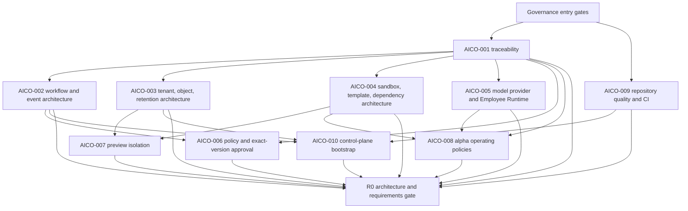

# AI Company OS Backend — Next Governed Iteration Plan

**Prepared:** 2026-08-12  
**Planning horizon:** Sprint 0 — Decisions & Foundation  
**Target milestone/gate:** M0 / R0  
**Authoritative plan:** `duckvhuynh/aicompanyos` Product v0.1 and delivery documents  
**Implementation repository:** `duckvhuynh/aico-backend`  
**GitHub Project:** `duckvhuynh` Project 2, **AI Company OS — Governed Prototype MVP**

## Recommendation

Finish the two draft governance changes, then pull only the two parent issues that have no declared dependencies:

1. **AICO-001 — Baseline product-to-delivery traceability** in the parent repository.
2. **AICO-009 — Establish repository quality and CI baseline** in the backend repository, using a backend child issue that links to `duckvhuynh/aicompanyos#9`.

AICO-001 and AICO-009 are the only parent issues currently dependency-unblocked. Project 2 shows every parent AICO issue in `Inbox`; a completed backend child issue does not satisfy a parent dependency. The existing backend foundation may be used as implementation or spike evidence only after its evidence is mapped to the exact parent acceptance criterion.

After AICO-001 and AICO-009 are `Done`, pull the remaining Sprint 0 issues in their declared dependency order. Do not start new AICO-011+ product work until all AICO-001–010 issues are `Done` and R0 passes.

## Authoritative Scope

The exact Sprint 0 goal is:

> Resolve TD-001–010 and establish CI, application, relational, and object-storage foundations without adding product scope.

The exact R0 exit requirements are:

- Every PRD Must and SRS FR/NFR maps to at least one owned backlog issue and verification method.
- TD-001–010 and PRD-OQ-001–003/005 have accepted decisions; OQ-004/007/008 have owners and pre-alpha deadlines.
- The chosen architecture supports persisted human waits, exact-version approvals, transactional outbox, tenant/object isolation, sandbox termination, isolated preview, and version rollback.
- CI runs lint/static checks, unit/contract tests, production build, and migration checks; external provider/build fixtures work deterministically.

This iteration does not authorize generated backends, production deployment, arbitrary employee/tool/model configuration, team collaboration, repository import, or any other explicit MVP non-goal. The generated-prototype stack remains fixed React + TypeScript, client-side only; no Laravel, Livewire, or FluxUI stack is assumed.

## Observed Baseline

Read-only inspection was performed on 2026-08-12 against the local repositories, GitHub issues/pull requests, and Project 2.

| Item                           | Observed state                                                                                                                                                            | Planning consequence                                                                                                                                                                                   |
| ------------------------------ | ------------------------------------------------------------------------------------------------------------------------------------------------------------------------- | ------------------------------------------------------------------------------------------------------------------------------------------------------------------------------------------------------ |
| Backend issue `aico-backend#1` | Closed; Project status `Done`                                                                                                                                             | Its governed PM vertical slice is useful evidence, but it does not make any referenced parent AICO issue `Done`.                                                                                       |
| Backend issue `aico-backend#2` | Open; Project status `In review`                                                                                                                                          | It remains a gate until its PR is reviewed, merged, acceptance criteria are reconciled, and the issue is closed.                                                                                       |
| Backend PR `aico-backend#3`    | Open draft; mergeable; governance, verify, and Docker smoke checks pass                                                                                                   | Review and merge before opening the next backend implementation PR. A draft is not review-complete evidence.                                                                                           |
| Parent PR `aicompanyos#93`     | Open draft; mergeable; no checks reported                                                                                                                                 | Merge the nested-repository ignore rule before the next iteration branch is cut. This contributes to AICO-009 hygiene but cannot complete AICO-009.                                                    |
| Parent AICO-001–010            | All open and `Inbox` in Project 2                                                                                                                                         | None is dependency-satisfying. Move an issue through Ready/In progress/In review/Done only with issue-level evidence.                                                                                  |
| Parent AICO-001 and AICO-009   | `Dependencies: none`                                                                                                                                                      | These are the initial pull.                                                                                                                                                                            |
| Current backend                | NestJS API/worker/migrate roles; PostgreSQL state/outbox/leases; MinIO readiness boundary; deterministic PM provider; migrations; smoke path to `AWAITING_BRIEF_APPROVAL` | Preserve and assess this work. Do not delete or redo it merely because it landed before parent issue completion.                                                                                       |
| Current verification           | Formatting, lint, seven unit tests, production build, dependency audit, Compose validation, and Docker smoke are green on PR #3                                           | AICO-009 still needs issue-level proof of one foreground command, explicit unit/contract and migration gates, deterministic model/build/storage fixtures, and deliberate negative proof for each gate. |
| Architecture records           | ADR-002, ADR-003, and ADR-005 are accepted; ADR-001 and ADR-004 are still proposed                                                                                        | Proposed records cannot satisfy the relevant accepted-decision R0 condition. Parent acceptance criteria and named-owner acceptance still govern.                                                       |

## Iteration Entry Gates

No new backend product implementation begins until all general gates below pass:

- Backend PR #3 is no longer draft, receives review, remains green, merges to `aico-backend/main`, and backend issue #2 is reconciled and moved to `Done`.
- Parent PR #93 is no longer draft, receives review, merges to `aicompanyos/main`, and a fresh parent checkout no longer reports the nested backend checkout as untracked.
- The implementation branch starts from the updated backend `main`; no new work is stacked on the governance branch.
- The selected parent issue exists in Project 2, has all required fields, has acceptance criteria and named evidence, and is `Ready`.
- Every declared parent dependency is `Done` in Project 2. Closed child issues, merged code, proposed ADRs, or locally passing tests do not substitute for parent `Done`.
- Required external decision owners are named before work starts; an unresolved choice that can change the estimate by more than one point blocks `Ready`.
- The backend child issue references exactly one primary parent issue using `duckvhuynh/aicompanyos#N` and lists applicable Product/SRS/ADR/contract references.
- The work remains at most three points. If discovery makes it larger, split the backend child work before implementation without changing the parent outcome.

### Initial pull gate

After the general gates pass:

- Move AICO-001 and AICO-009 from `Inbox` to `Ready` only after owners and evidence plans are confirmed.
- AICO-001 is parent planning/governance work and should be changed in the parent repository.
- AICO-009 is the first backend implementation issue. Create a new backend child issue after backend issue #2 is `Done`; do not repurpose #2.

## Dependency Graph

## Pull Sequence

This is a dependency-driven pull order, not permission to mark a later issue active early.

| Wave | Parent issue       | May enter `Ready` when                                                                       | Required outcome                                                                                          |
| ---- | ------------------ | -------------------------------------------------------------------------------------------- | --------------------------------------------------------------------------------------------------------- |
| 0    | Governance reviews | Current draft evidence is complete and a reviewer is assigned                                | PR #3 and PR #93 merge; child #2 becomes `Done`; both `main` branches are the new base.                   |
| 1A   | AICO-001           | General entry gates pass                                                                     | Complete requirement/verification ownership and cross-functional baseline acceptance.                     |
| 1B   | AICO-009           | General entry gates pass                                                                     | Close the CI/quality gaps and prove all acceptance criteria in one governed backend PR.                   |
| 2A   | AICO-002           | AICO-001 is `Done`                                                                           | Accept durable workflow/event/outbox decision and pass pause/reload/resume plus duplicate-delivery spike. |
| 2B   | AICO-003           | AICO-001 is `Done`; Product/Security owner is available                                      | Accept tenant/object/retention architecture and its cross-boundary threat test plan.                      |
| 2C   | AICO-004           | AICO-001 is `Done`; Security/Platform and Design owners are available                        | Accept sandbox/template/package decision and pass required denial/build spike.                            |
| 2D   | AICO-005           | AICO-001 is `Done`; provider access/content-use owner is available                           | Accept provider/runtime abstraction and deterministic failure matrix.                                     |
| 3A   | AICO-006           | AICO-001 and AICO-002 are `Done`                                                             | Accept default-deny and exact-version approval architecture with zero-side-effect negative matrix.        |
| 3B   | AICO-007           | AICO-003 and AICO-004 are `Done`                                                             | Accept preview isolation architecture and prove private control API denial.                               |
| 3C   | AICO-008           | AICO-001, AICO-004, and AICO-005 are `Done`; Product/Design/QA/Security owners are available | Version qualification, QA, budget, attachment, and capacity limits with owners and reason codes.          |
| 3D   | AICO-010           | AICO-002, AICO-003, and AICO-009 are `Done`                                                  | Complete approved skeleton/configuration/storage gaps and fresh setup/migration/rollback/object evidence. |
| 4    | R0 decision        | AICO-001–010 are `Done`                                                                      | Record R0 pass/conditional/fail. Only a pass permits Sprint 1 pull.                                       |

Wave 2 issues may run in parallel only when different owners are available and each owner has no more than one active issue. Wave 3 follows the same rule. If an external decision is unavailable for more than one working day, move that issue to `Blocked` and replan its dependants; do not bypass it with a code assumption.

## Work Packages — Each Task Is One Day or Less

The parent issue remains the unit of outcome. These bounded work packages are implementation/review slices, not new scope.

### Entry and governance

| Task                                                                                                                   | Estimate | Acceptance evidence                                                           |
| ---------------------------------------------------------------------------------------------------------------------- | -------: | ----------------------------------------------------------------------------- |
| Review backend PR #3 against backend issue #2 and AICO-009, including one valid and one invalid governance-body result |  0.5 day | Review recorded; three checks green; governance negative case exits non-zero. |
| Review parent PR #93 and verify its diff is limited to the nested-repository ignore rule                               | 0.25 day | Reviewed one-file diff and clean parent status with nested checkout present.  |
| Merge/sync handoff and fresh-branch readiness check                                                                    | 0.25 day | Both `main` heads recorded; fresh backend branch has no unrelated diff.       |

### AICO-001 — Baseline product-to-delivery traceability

| Task                                                                                                                                                                   | Estimate | Acceptance evidence                                                        |
| ---------------------------------------------------------------------------------------------------------------------------------------------------------------------- | -------: | -------------------------------------------------------------------------- |
| Expand the trace table so every MVP capability, PRD Must, SRS FR/NFR, AT-001–015, and explicit non-goal has an owner role, implementation issue, and verification type |    1 day | Automated orphan/duplicate scan plus reviewed trace table.                 |
| Reconcile the conflict/open-decision log with owner, deadline, and explicitly blocked AICO issues                                                                      |  0.5 day | Decision log review; all required pre-development/pre-alpha dates present. |
| Obtain Product, Engineering, QA/Security, and Delivery acceptance of Product v0.1 and its change-control rule                                                          |  0.5 day | Named acceptance recorded on AICO-001; all issue checkboxes reconciled.    |

### AICO-009 — Repository quality and CI baseline

| Task                                                                                                                                                            | Estimate | Acceptance evidence                                                         |
| --------------------------------------------------------------------------------------------------------------------------------------------------------------- | -------: | --------------------------------------------------------------------------- |
| Reconcile the current toolchain/CI against all three AICO-009 acceptance criteria and define the single foreground verification command                         |  0.5 day | Gap checklist and command contract in the child issue/PR.                   |
| Add or wire explicit lint/static/type, unit/contract, migration, and production-build gates without relying on a developer-started server or background command |    1 day | Fresh checkout command and CI run cover every named gate.                   |
| Complete deterministic model, build-boundary, and storage fixtures using no paid external service                                                               |    1 day | Fixture tests pass offline and identify their pinned inputs.                |
| Prove each CI gate fails for its deliberate invalid fixture and document required-check behavior                                                                | 0.75 day | Negative matrix records command, expected non-zero result, and CI evidence. |

If these remaining AICO-009 gaps cannot fit the existing three-point estimate after reusing current work, split the backend child work before `Ready` and re-estimate. Do not silently weaken the acceptance criteria.

### AICO-002 — Durable workflow and event architecture

| Task                                                                                                                                              | Estimate | Acceptance evidence                                            |
| ------------------------------------------------------------------------------------------------------------------------------------------------- | -------: | -------------------------------------------------------------- |
| Reconcile the accepted runtime ADR with alternatives and all persisted-wait/version/retry/cancel/idempotency criteria                             |  0.5 day | Reviewed option matrix and resolved ADR status/owner.          |
| Extend the deterministic spike to pause, reload from PostgreSQL, resume, and receive a duplicate delivery without a duplicate logical side effect |    1 day | Integration/fault test with state, event, and outbox evidence. |
| Record claim/lease, ordering/deduplication, migration, and rollback decisions                                                                     |  0.5 day | Accepted ADR and linked test evidence.                         |

### AICO-003 — Tenant, object-storage, and retention architecture

| Task                                                                                                                            | Estimate | Acceptance evidence                                         |
| ------------------------------------------------------------------------------------------------------------------------------- | -------: | ----------------------------------------------------------- |
| Complete the tenant-key and authorization map across rows, objects, model context, preview, export, logs, backups, and deletion | 0.75 day | Reviewed boundary table and non-disclosing denial contract. |
| Record object key, signed access, encryption, checksum, retention/expiry/deletion, backup, and security-hold approaches         | 0.75 day | Accepted ADR; OQ-004 owner/deadline recorded.               |
| Define cross-row/object/model/preview/export negative tests and non-waivable checks                                             |  0.5 day | Versioned threat-test matrix linked to the issue.           |

### AICO-004 — Sandbox, template, and dependency architecture

| Task                                                                                                                                                          | Estimate | Acceptance evidence                                     |
| ------------------------------------------------------------------------------------------------------------------------------------------------------------- | -------: | ------------------------------------------------------- |
| Accept the workspace/process/filesystem/network/credential/resource/output/termination design and dependency acquisition policy                               | 0.75 day | Accepted ADR with Security/Platform sign-off.           |
| Accept the fixed React/TypeScript template decision for at most five responsive client routes, local/mock data, pinned packages/licenses, build, and rollback | 0.75 day | Design/Engineering sign-off and versioned manifest.     |
| Run the bounded spike: deny host path, cross-workspace read, unrestricted egress, and non-allowlisted command while completing a fixture build                |    1 day | Security/build evidence with no production credentials. |

### AICO-005 — Model provider and Employee Runtime abstraction

| Task                                                                                                                          | Estimate | Acceptance evidence                                      |
| ----------------------------------------------------------------------------------------------------------------------------- | -------: | -------------------------------------------------------- |
| Finalize typed provider request/result, timeout/cancel, schema, version, usage/cost, latency, and classified-failure contract | 0.75 day | Accepted interface/ADR and contract tests.               |
| Add deterministic malformed-output, timeout, rate-limit, cancellation, and safety/redaction scenarios beside success          | 0.75 day | Offline deterministic matrix passes with pinned outputs. |
| Record provider choice/access, content-use terms, secret boundary, targeting, and rollback                                    |  0.5 day | Named owner acceptance; no secret/prompt body in logs.   |

### AICO-006 — Policy and exact-version approval architecture

| Task                                                                                                                                                         | Estimate | Acceptance evidence                                              |
| ------------------------------------------------------------------------------------------------------------------------------------------------------------ | -------: | ---------------------------------------------------------------- |
| Finalize current-state, parameter-bound, expiring/versioned default-deny policy inputs and reason codes                                                      | 0.75 day | Accepted ADR/contract and policy contract tests.                 |
| Specify the founder approval transaction across identity, expected state, gate, exact artifact version, decision/event, and idempotent downstream transition | 0.75 day | Transaction/sequence test design reviewed.                       |
| Execute employee/operator/direct/stale/cross-tenant/duplicate denial matrix                                                                                  |    1 day | Every denial has zero downstream side effect and safe telemetry. |

### AICO-007 — Preview isolation architecture

| Task                                                                                                      | Estimate | Acceptance evidence                    |
| --------------------------------------------------------------------------------------------------------- | -------: | -------------------------------------- |
| Accept isolated-origin, headers, signed access, expiry/revocation, integrity, caching, and cleanup design | 0.75 day | Accepted ADR and threat model.         |
| Serve fixture output and deny control identity/cookies/storage/private APIs/other preview/expired token   |    1 day | Isolation spike and negative evidence. |

### AICO-008 — Alpha qualification, QA, budget, attachment, and capacity policies

| Task                                                                                                                  | Estimate | Acceptance evidence                                       |
| --------------------------------------------------------------------------------------------------------------------- | -------: | --------------------------------------------------------- |
| Version eligible goal, one-flow/five-screen/client/mock, attachment, blocking/advisory check, and regression policies | 0.75 day | Product/Design/QA/Security-approved policy record.        |
| Version token/compute/storage/wall-time/file/output/retry/rework/concurrency limits and stop behavior                 | 0.75 day | Configuration schema and boundary tests.                  |
| Assign owner, rationale, configuration key/version, founder-visible reason code, and review date to every value       |  0.5 day | Completeness check reports no unowned or unlimited value. |

### AICO-010 — Control plane, persistence, object storage, and configuration

| Task                                                                                                                                                               | Estimate | Acceptance evidence                                                             |
| ------------------------------------------------------------------------------------------------------------------------------------------------------------------ | -------: | ------------------------------------------------------------------------------- |
| Reconcile the existing skeleton with the accepted AICO-002/AICO-003 decisions; close only missing application, transaction, object-client, and configuration seams | 0.75 day | Focused gap diff; no premature Sprint 1+ feature expansion.                     |
| Prove missing/invalid configuration fails safely and health remains distinct from dependency readiness                                                             |  0.5 day | Configuration and health/readiness integration tests without secret disclosure. |
| Prove fresh setup, migration, compensating rollback/reapply, production build, and tenant-scoped object fixture                                                    |    1 day | One fresh-environment evidence bundle linked to AICO-010.                       |

## Test Matrix

Every row is blocking for the issue shown. Evidence must name the commit, command/workflow run, fixture version, and result.

| ID    | Layer                      | Scenario                                                                                                                 | Parent issue       | Required pass evidence                                                         |
| ----- | -------------------------- | ------------------------------------------------------------------------------------------------------------------------ | ------------------ | ------------------------------------------------------------------------------ |
| T-001 | Governance contract        | Complete PR body passes; missing parent reference, product/architecture reference, evidence, or scope check fails        | AICO-009           | Positive and negative exit codes from the same committed governance checker.   |
| T-002 | Static/build               | Formatting, lint, TypeScript/static analysis, and Nest production build                                                  | AICO-009           | One documented foreground verification command and blocking CI results.        |
| T-003 | Unit/contract              | API/event/task/provider/config schemas and current domain unit suite                                                     | AICO-009           | Deterministic tests pass; invalid fixture for each gate fails as expected.     |
| T-004 | Migration                  | Clean apply, schema compatibility, compensating rollback, and reapply on a disposable database                           | AICO-009, AICO-010 | Migration evidence is explicit, not inferred only from API readiness.          |
| T-005 | Deterministic adapters     | Model success/malformed/timeout/rate-limit/cancel/safety plus bounded build and storage fixture                          | AICO-005, AICO-009 | No paid call; pinned scenario/version and stable classified result.            |
| T-006 | Durable integration        | Human wait survives worker/process reload; duplicate command/event produces one logical side effect                      | AICO-002           | PostgreSQL state, ordered event, outbox/inbox, and attempt evidence reconcile. |
| T-007 | Tenant/storage security    | Foreign row/object/model/preview/export references fail without disclosure                                               | AICO-003           | Denial matrix and security signal contain no foreign content.                  |
| T-008 | Sandbox architecture spike | Host path, cross-workspace, arbitrary command, egress, credential, and resource violations fail; approved fixture builds | AICO-004           | Bounded evidence from isolated execution; termination proven.                  |
| T-009 | Approval/policy security   | Employee/operator/direct/stale/cross-tenant/duplicate exact-version approval attempts                                    | AICO-006           | All unauthorized attempts fail with zero state/event/task side effect.         |
| T-010 | Preview isolation spike    | Generated fixture cannot access control cookies/storage/private APIs/other previews; expiry/revocation works             | AICO-007           | Separate-origin test and signed-access failure evidence.                       |
| T-011 | Policy configuration       | Every qualification/QA/budget/attachment/capacity value is bounded, versioned, owned, and reason-coded                   | AICO-008           | Schema/completeness test and owner review.                                     |
| T-012 | Configuration/readiness    | Missing config fails closed without echoing secrets; liveness differs from database/object/migration readiness           | AICO-010           | Integration results for healthy and degraded dependency states.                |
| T-013 | Object fixture             | Canonical tenant key, put/head/get/checksum, and cross-tenant denial against disposable S3-compatible storage            | AICO-009, AICO-010 | Offline/local evidence; object body or credentials absent from logs.           |
| T-014 | Requirement trace          | Orphan, duplicate, missing owner, missing implementation issue, missing verification, and non-goal coverage scan         | AICO-001           | Scan reports zero unexplained gaps; cross-functional review linked.            |

Tests must run as foreground commands. No command in the evidence plan may append `&`, start an unmanaged server, or depend on a paid provider. CI orchestration may run services only within a bounded attached job that always cleans up.

## GitHub Linking and Status Protocol

### Parent/child/PR linkage

- The parent issue in `duckvhuynh/aicompanyos` is the delivery authority and dependency truth.
- One backend child issue describes the bounded backend contribution and includes `Parent AICO issue: duckvhuynh/aicompanyos#N` plus Product/SRS/ADR/contract references.
- The implementation PR includes `Refs duckvhuynh/aicompanyos#N` and `Closes #<backend-child>`; it does not claim to close a cross-repository parent automatically.
- Link the backend child issue and PR in the parent issue's evidence. Reconcile every parent acceptance checkbox before closing the parent.
- A PR that happens to reference several future issues is not acceptance evidence for those issues until the relevant criteria are independently demonstrated and reviewed.

### Project status transitions

| Condition                                                                              | Parent status                                           | Backend child status                        |
| -------------------------------------------------------------------------------------- | ------------------------------------------------------- | ------------------------------------------- |
| Planned but entry/dependency gate incomplete                                           | `Inbox` or `Blocked`                                    | Not opened, or `Blocked` if already present |
| Definition of Ready passes                                                             | `Ready`                                                 | `Ready`                                     |
| First implementation/document change begins                                            | `In progress`                                           | `In progress`                               |
| PR is no longer draft, all required checks/evidence are ready, and review is requested | `In review`                                             | `In review`                                 |
| PR is merged and all child acceptance criteria pass                                    | Remains `In review` until parent evidence is reconciled | `Done`                                      |
| Parent acceptance criteria and required owner acceptance are complete                  | `Done`                                                  | `Done`                                      |
| Reopened defect invalidates acceptance                                                 | `Ready`                                                 | `Ready` or a new linked child issue         |

Only parent `Done` satisfies a dependency. A closed issue, green draft PR, `In review`, or child `Done` does not.

### Blocked and carryover rules

- If a dependency or external decision blocks work for more than one working day, set `Blocked`, identify the blocker/owner/due date, and replan all downstream issues.
- Removing a `blocked` label returns an issue to `Ready`; it never implies `Done`.
- Incomplete sprint work returns to `Ready`, is re-estimated, and receives an explicit Sprint. There is no silent carryover.
- Any scope change requires an authoritative Product revision and delivery rebaseline before implementation or Project field changes.
- Keep one active issue per engineer unless pairing is explicitly recorded.

## Repeatable Plan → Implement → Test → Review Loop

1. **Plan**
   - Read the parent issue and authoritative Product/SRS sections.
   - Verify every declared dependency is `Done` in Project 2.
   - Reconcile current code/ADR evidence against each acceptance criterion.
   - Name the owner, bounded child outcome, negative paths, test evidence, rollback, and data/security implications.
   - Move the issue to `Ready` only when the Definition of Ready passes.

2. **Implement**
   - Branch from current `aico-backend/main` after prior work merges.
   - Move the parent and child to `In progress`.
   - Reuse compatible foundation work; make only the gap changes authorized by the parent issue.
   - Keep authoritative state, tenant boundaries, immutable lineage, and deny-by-default behavior intact.
   - If work exceeds three points or an assumption changes the outcome, stop and split/replan before continuing.

3. **Test**
   - Run the one documented foreground verifier from a clean checkout.
   - Run the targeted positive, negative, migration/rollback, security, resilience, or fixture rows from the test matrix.
   - Record commit, command/workflow URL, environment/fixture versions, actual result, and any residual limitation.
   - Never use a manually edited database, fabricated event, or manually asserted success as passing evidence.

4. **Review**
   - Complete the PR traceability, evidence, scope, and operational/rollback sections.
   - Remove draft status only when required checks and issue evidence are ready; then move to `In review`.
   - Review code and acceptance evidence separately. Green CI alone is not parent acceptance.
   - Merge, reconcile/close the backend child, then reconcile every parent criterion and owner acceptance.
   - Move the parent to `Done` only after all evidence is linked. Re-evaluate newly unblocked issues; do not auto-start them.

5. **Learn and replan**
   - Record one or two concrete process/test improvements.
   - Update estimates only through the sprint replanning rule.
   - Carry evidence forward, but do not carry status forward when acceptance is incomplete.

## R0 Exit Gate

Sprint 0 may exit only when all conditions below are true:

- Parent AICO-001 through AICO-010 are each `Done` in Project 2 with linked acceptance evidence.
- The four exact R0 requirements in this document pass.
- TD-001–010 are accepted, versioned, owned decisions. No relevant ADR remains merely `Proposed`.
- PRD-OQ-001–003/005 are resolved; OQ-004/007/008 have named owners and pre-alpha deadlines.
- A fresh checkout passes the documented foreground quality command, explicit migration/rollback checks, deterministic adapter/build/storage fixtures, and required negative cases.
- The durable wait, duplicate-delivery, tenant/object boundary, sandbox termination, exact-version approval, preview isolation, configuration/readiness, and rollback spikes have linked reproducible evidence.
- No critical or unowned finding remains in approval integrity, tenant isolation, sandbox, secret handling, event/artifact durability, or configuration safety.
- Product, Engineering, QA/Security, and Delivery record the R0 decision.
- No AICO-011+ issue is treated as dependency-satisfied merely because related foundation code already exists.

A conditional or failed R0 does not permit Sprint 1 product work. The date moves before any approval, tenant, sandbox, durability, or CI control is weakened.

## Risks and Controls

| Risk                                                           | Trigger                                                                                     | Control / owner                                                                                                 |
| -------------------------------------------------------------- | ------------------------------------------------------------------------------------------- | --------------------------------------------------------------------------------------------------------------- |
| Foundation code is mistaken for parent completion              | A child issue or PR references many parent issues, while the parent issues remain `Inbox`   | Delivery reconciles evidence criterion by criterion; only parent `Done` unlocks dependants.                     |
| Governance is bypassed because current PRs are still drafts    | New feature branch/issue starts before PR #3 and #93 merge                                  | Engineering/Delivery enforce the iteration entry gate.                                                          |
| AICO-001 sign-off blocks all architecture work                 | Cross-functional owner or trace gap is unavailable for more than one day                    | Set AICO-001 and all dependants `Blocked`; schedule owner decision; do not assume acceptance.                   |
| Existing ADR statuses conflict                                 | A relevant ADR remains `Proposed`, or accepted records overlap without a clear authority    | Architecture owner reconciles status/scope and links the accepted decision to its parent issue.                 |
| AICO-009 is closed from green CI alone                         | Migration/contract/fixture/negative proof is missing                                        | Use the AICO-009 gap checklist and T-001–T-005/T-013; green PR #3 is partial evidence only.                     |
| External Sprint 0 choices are unavailable                      | Product/Security/Platform/Design/provider owners are not named for AICO-003/004/005/008     | Mark the affected issue `Blocked` after one day and replan its declared dependants.                             |
| Current vertical slice continues into later MVP features       | AICO-011+ endpoint/domain work begins before R0                                             | Freeze feature expansion; restrict changes to accepted S0 gaps and test evidence.                               |
| One PR bundles multiple parent outcomes                        | Review cannot determine which acceptance criterion a change proves                          | Use one primary parent issue and one bounded backend child/PR; split before Ready.                              |
| CI uses unmanaged background services or passes unreproducibly | Verification requires manual server startup, daemonized local state, or paid provider calls | One bounded foreground verifier, disposable dependencies, deterministic fixtures, and unconditional cleanup.    |
| Concurrent work overwrites existing changes                    | A branch is based on an old governance head or rewrites foundation files broadly            | Start from merged `main`, inspect current diff before edits, keep focused patches, and preserve unrelated work. |

## Immediate Next Action

Assign reviewers to backend PR #3 and parent PR #93. Once both merge and backend issue #2 is `Done`, move parent AICO-001 and AICO-009 to `Ready`, open a new AICO-009 backend child issue, and begin Wave 1. No GitHub state was changed while producing this plan.
